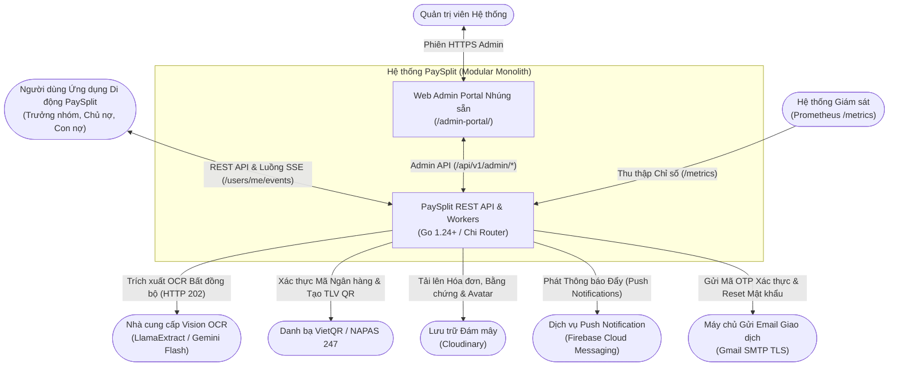
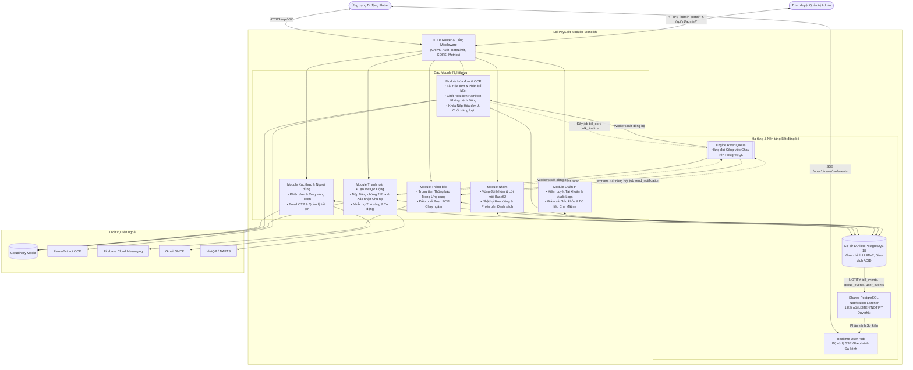
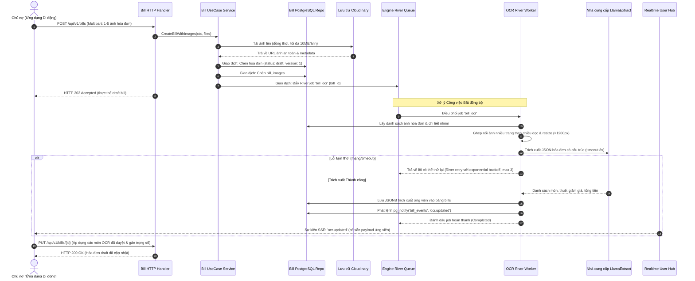
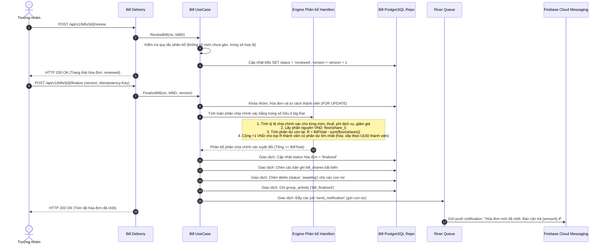
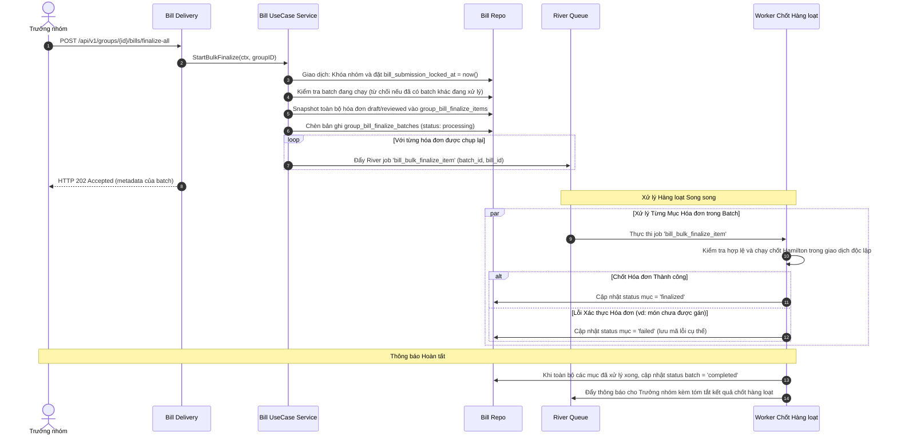
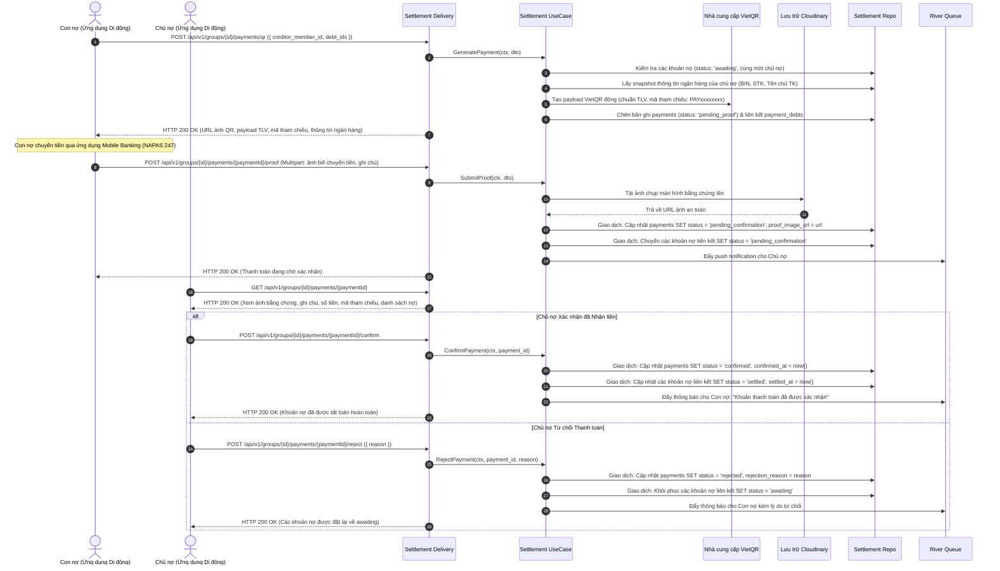
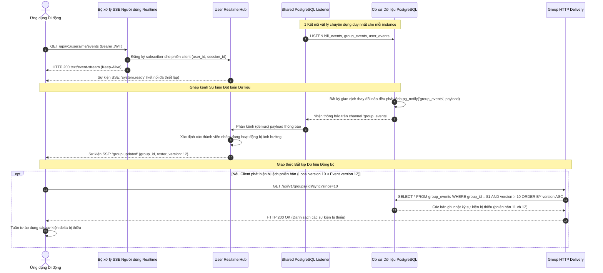
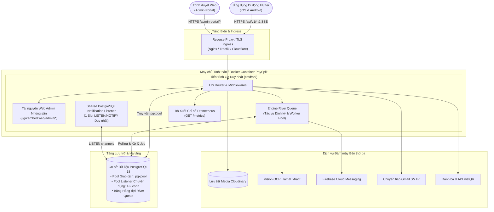
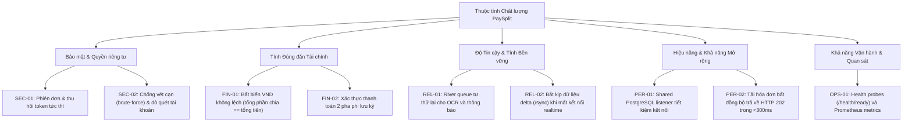

# **PAYSPLIT - HỆ THỐNG CHIA TIỀN HÓA ĐƠN THÔNG MINH**

## **Tài liệu Thiết kế Kỹ thuật (Technical Design Document)**

| Đội ngũ PaySplit | |
| :--- | :--- |
| **Thành viên nhóm** | Phạm Lê Hoàng Nam<br>Phạm Thanh Lam<br>Nguyễn Trọng Tín |
| **Mentor** | Trần Quang Hiển (VSF-FINTECH-VDTDVTC) |
| **Ext Mentor** | Bành Quốc Danh (VSF-FINTECH&TT-PTPM)<br>Phan Công Huân (VSF-FINTECH-VDTDVTC)<br>Nguyễn Mạnh Tể (VSF-FINTECH&TT-PTPM)<br>Nguyễn Nam Trường (VSF-FINTECH-VDTDVTC) |

<p align="center">– Hà Nội, Tháng 09/2026 –</p>

---

## **Mục lục**

- [**I. Lịch sử Thay đổi**](#i-lịch-sử-thay-đổi)
- [**II. Tài liệu Thiết kế Kỹ thuật**](#ii-tài-liệu-thiết-kế-kỹ-thuật)
  - [**1. Bối cảnh Hệ thống**](#1-bối-cảnh-hệ-thống)
    - [1.1 Sơ đồ Bối cảnh (Context Diagram)](#11-sơ-đồ-bối-cảnh-context-diagram)
    - [1.2 Các Tác nhân và Hệ thống Bên ngoài](#12-các-tác-nhân-và-hệ-thống-bên-ngoài)
  - [**2. Kiến trúc Hệ thống**](#2-kiến-trúc-hệ-thống)
    - [2.1 Bounded Contexts và Bản đồ Tích hợp](#21-bounded-contexts-và-bản-đồ-tích-hợp)
    - [2.2 Quyền sở hữu Dữ liệu và Mô hình Dữ liệu Logic (ERD)](#22-quyền-sở-hữu-dữ-liệu-và-mô-hình-dữ-liệu-logic-erd)
    - [2.3 Sơ đồ Tuần tự (Sequence Diagrams)](#23-sơ-đồ-tuần-tự-sequence-diagrams)
      - [2.3.1 Đăng ký Người dùng, Email OTP và Xoay vòng Phiên đăng nhập](#231-đăng-ký-người-dùng-email-otp-và-xoay-vòng-phiên-đăng-nhập)
      - [2.3.2 Tải lên Hóa đơn, River Queue Xử lý OCR Bất đồng bộ và Phát Realtime SSE](#232-tải-lên-hóa-đơn-river-queue-xử-lý-ocr-bất-đồng-bộ-và-phát-realtime-sse)
      - [2.3.3 Kiểm tra Hóa đơn, Thuật toán Chia tiền Hamilton và Chốt Hóa đơn Nguyên tử](#233-kiểm-tra-hóa-đơn-thuật-toán-chia-tiền-hamilton-và-chốt-hóa-đơn-nguyên-tử)
      - [2.3.4 Khóa Nộp Hóa đơn có Kiểm soát của Trưởng nhóm và Chốt Hàng loạt (Bulk Finalize Batch)](#234-khóa-nộp-hóa-đơn-có-kiểm-soát-của-trưởng-nhóm-và-chốt-hàng-loạt-bulk-finalize-batch)
      - [2.3.5 Tạo VietQR Động, Nộp Bằng chứng Chuyển khoản và Xác nhận Thanh toán](#235-tạo-vietqr-động-nộp-bằng-chứng-chuyển-khoản-và-xác-nhận-thanh-toán)
      - [2.3.6 Kiến trúc Realtime Hợp nhất, Shared PostgreSQL Listener và Bắt kịp Đồng bộ (/sync)](#236-kiến-trúc-realtime-hợp-nhất-shared-postgresql-listener-và-bắt-kịp-đồng-bộ-sync)
    - [2.4 Kiến trúc Triển khai & Hạ tầng](#24-kiến-trúc-triển-khai--hạ-tầng)
    - [2.5 Kiến trúc Bảo mật & Ranh giới Tin cậy (Trust Boundaries)](#25-kiến-trúc-bảo-mật--ranh-giới-tin-cậy-trust-boundaries)
    - [2.6 Cây Tiện ích Thuộc tính Chất lượng (Quality Attribute Utility Tree)](#26-cây-tiện-ích-thuộc-tính-chất-lượng-quality-attribute-utility-tree)
    - [2.7 Hồ sơ Quyết định Kiến trúc (ADRs)](#27-hồ-sơ-quyết-định-kiến-trúc-adrs)

---

## **Danh mục Bảng**

- [Bảng 1. Lịch sử Thay đổi](#bảng-1-lịch-sử-thay-đổi)
- [Bảng 2. Các Tác nhân và Hệ thống Bên ngoài](#bảng-2-các-tác-nhân-và-hệ-thống-bên-ngoài)
- [Bảng 3. Các Bounded Context](#bảng-3-các-bounded-context)
- [Bảng 4. Các Thực thể Cốt lõi & Quyền sở hữu Dữ liệu](#bảng-4-các-thực-thể-cốt-lõi--quyền-sở-hữu-dữ-liệu)
- [Bảng 5. Ranh giới Tin cậy & Kiểm soát Bảo mật](#bảng-5-ranh-giới-tin-cậy--kiểm-soát-bảo-mật)
- [Bảng 6. Bảo vệ Dữ liệu Nhạy cảm](#bảng-6-bảo-vệ-dữ-liệu-nhạy-cảm)
- [Bảng 7. Cây Tiện ích Thuộc tính Chất lượng](#bảng-7-cây-tiện-ích-thuộc-tính-chất-lượng)

---

## **Danh mục Hình**

- [Hình 1. Sơ đồ Bối cảnh Hệ thống (System Context Diagram)](#hình-1-sơ-đồ-bối-cảnh-hệ-thống-system-context-diagram)
- [Hình 2. Sơ đồ Bounded Context và Bản đồ Tích hợp](#hình-2-sơ-đồ-bounded-context-và-bản-đồ-tích-hợp)
- [Hình 3. Mô hình Dữ liệu Logic (Entity Relationship Diagram - ERD)](#hình-3-mô-hình-dữ-liệu-logic-entity-relationship-diagram---erd)
- [Hình 4. Luồng Xác thực, Đăng ký và Xoay vòng Phiên](#hình-4-luồng-xác-thực-đăng-ký-và-xoay-vòng-phiên)
- [Hình 5. Pipeline Xử lý OCR Hóa đơn Bất đồng bộ](#hình-5-pipeline-xử-lý-ocr-hóa-đơn-bất-đồng-bộ)
- [Hình 6. Luồng Phân bổ Hóa đơn và Chốt Hóa đơn Hamilton](#hình-6-luồng-phân-bổ-hóa-đơn-và-chốt-hóa-đơn-hamilton)
- [Hình 7. Luồng Khóa Nộp Hóa đơn và Chốt Hàng loạt Nhóm](#hình-7-luồng-khóa-nộp-hóa-đơn-và-chốt-hàng-loạt-nhóm)
- [Hình 8. Luồng Tạo VietQR Động, Nộp Bằng chứng và Xác nhận](#hình-8-luồng-tạo-vietqr-động-nộp-bằng-chứng-và-xác-nhận)
- [Hình 9. Luồng Ghép kênh Sự kiện Realtime Hợp nhất và Bắt kịp Delta](#hình-9-luồng-ghép-kênh-sự-kiện-realtime-hợp-nhất-và-bắt-kịp-delta)
- [Hình 10. Tô-pô Triển khai và Hạ tầng](#hình-10-tô-pô-triển-khai-và-hạ-tầng)
- [Hình 11. Cây Tiện ích Thuộc tính Chất lượng](#hình-11-cây-tiện-ích-thuộc-tính-chất-lượng)

---

# I. Lịch sử Thay đổi

\*A - Thêm mới (Added) M - Sửa đổi (Modified) D - Xóa (Deleted)

| Ngày | A*M, D | Người phụ trách | Mô tả Thay đổi |
| :--- | :---: | :--- | :--- |
| 14/08/2026 | A | NamPLH | Khởi tạo khung TDD; nhập các mục tiêu thiết kế sơ bộ từ PRD. |
| 14/08/2026 | A | Tất cả thành viên | Hoàn thành nội dung bản thảo ban đầu. |
| 05/09/2026 | M | Tất cả thành viên | **Đại tu Toàn diện Kiến trúc:** Đồng bộ hóa TDD với backend Go 1.24+ và mobile app Flutter trên 16 database migrations và 10 technical specs.<br>• Loại bỏ khái niệm cũ "Trip/End trip", thay bằng cơ chế chốt hóa đơn sinh nợ trực tiếp và điều phối VietQR động theo yêu cầu.<br>• Bổ sung kiến trúc hàng đợi nền River Queue chạy trên PostgreSQL 18.<br>• Bổ sung pipeline OCR đa ảnh bất đồng bộ qua LlamaExtract (HTTP 202 Accepted).<br>• Tài liệu hóa thuật toán chia tiền phần dư lớn nhất Hamilton (`big.Rat`, không lệch 1 đồng VND).<br>• Bổ sung cơ chế khóa/mở nộp hóa đơn nhóm và xử lý batch chốt toàn bộ hàng loạt.<br>• Chi tiết hóa kiến trúc Realtime tiết kiệm kết nối (Shared PostgreSQL `LISTEN/NOTIFY` listener, luồng SSE `/api/v1/users/me/events` hợp nhất và cơ chế bắt kịp `/groups/{id}/sync`).<br>• Cập nhật tô-pô triển khai nhúng Web Admin Portal (`//go:embed`), health probes và Prometheus metrics.<br>• Mở rộng hồ sơ quyết định kiến trúc từ ADR-01 đến ADR-11. |

<a id="bảng-1-lịch-sử-thay-đổi"></a>
*Bảng 1. Lịch sử Thay đổi*

---

# II. Tài liệu Thiết kế Kỹ thuật

## 1. Bối cảnh Hệ thống

Tại ranh giới hệ thống, **PaySplit** là nền tảng điều phối chia tiền hóa đơn nhóm thông minh và thanh toán phi lưu ký (non-custodial). Người dùng tương tác với PaySplit để quản lý các khoản chi tiêu chung của nhóm, số hóa hóa đơn giấy thông qua trích xuất Vision LLM, tính toán phần chia công bằng về mặt toán học, và thanh toán số dư trực tiếp ngang hàng (P2P) qua chuyển khoản ngân hàng bằng VietQR động (NAPAS 247). PaySplit điều phối các giao dịch và bằng chứng thanh toán mà không giữ tiền của người dùng (tuân thủ đầy đủ Nghị định 52/2024/NĐ-CP của Chính phủ).

### 1.1 Sơ đồ Bối cảnh (Context Diagram)



<a id="hình-1-sơ-đồ-bối-cảnh-hệ-thống-system-context-diagram"></a>
*Hình 1. Sơ đồ Bối cảnh Hệ thống (System Context Diagram)*

### 1.2 Các Tác nhân và Hệ thống Bên ngoài

| Thành phần | Trách nhiệm & Tương tác |
| :--- | :--- |
| **Người dùng Ứng dụng Di động PaySplit** | Tạo nhóm, mời thành viên, chụp ảnh hóa đơn, chỉnh sửa phân bổ món, kiểm tra tính toán, thực hiện chuyển khoản VietQR ngang hàng, tải lên và xác nhận bằng chứng chuyển tiền. |
| **Quản trị viên Hệ thống** | Kiểm duyệt tài khoản người dùng (`active`, `suspended`, `locked`), kiểm tra dữ liệu tài chính đã che mặt nạ (masked), theo dõi hàng đợi tồn đọng và sức khỏe hệ thống qua Web Admin Portal nhúng sẵn. |
| **Nhà cung cấp OCR / Vision** | Dịch vụ LLM bên ngoài (LlamaExtract / Gemini Flash) trích xuất tên cửa hàng, từng món hàng, thuế, phụ phí và tổng tiền từ ảnh hóa đơn. |
| **Danh bạ VietQR / NAPAS** | Danh bạ ngân hàng quốc gia và chuẩn đặc tả QR EMVCo/TLV dùng để xác thực mã ngân hàng và sinh mã chuyển tiền liên ngân hàng có thể quét được. |
| **Lưu trữ Đối tượng (Cloudinary)** | Dịch vụ lưu trữ đám mây an toàn lưu giữ ảnh hóa đơn, ảnh chụp màn hình bằng chứng chuyển khoản và ảnh đại diện đại diện người dùng với cơ chế truy cập URL có chữ ký. |
| **Thông báo Đẩy (FCM)** | Firebase Cloud Messaging gửi cảnh báo đẩy chạy ngầm theo thời gian thực tới các thiết bị di động Android và iOS. |
| **Email Giao dịch (SMTP)** | Dịch vụ Gmail SMTP gửi mã OTP 6 chữ số phục vụ xác thực tài khoản và đặt lại mật khẩu. |
| **Hệ thống Giám sát Prometheus** | Thu thập dữ liệu từ endpoint `/metrics` về độ trễ yêu cầu HTTP, pool kết nối cơ sở dữ liệu đang hoạt động, trạng thái River worker và số lượng luồng SSE. |

<a id="bảng-2-các-tác-nhân-và-hệ-thống-bên-ngoài"></a>
*Bảng 2. Các Tác nhân và Hệ thống Bên ngoài*

---

## 2. Kiến trúc Hệ thống

### 2.1 Bounded Contexts và Bản đồ Tích hợp

PaySplit được cấu trúc dưới dạng một **Modular Monolith** tổ chức thành các domain module tuân thủ Clean Architecture (`internal/modules/*`). Các module giao tiếp đồng bộ thông qua Go interfaces tường minh và giao tiếp bất đồng bộ qua các tác vụ nền mang tính giao dịch sử dụng **River Queue** trên PostgreSQL và cơ chế **PostgreSQL `LISTEN/NOTIFY`** cho Server-Sent Events (SSE).



<a id="hình-2-sơ-đồ-bounded-context-và-bản-đồ-tích-hợp"></a>
*Hình 2. Sơ đồ Bounded Context và Bản đồ Tích hợp*

#### Mô tả các Bounded Context

| Context | Trách nhiệm Cốt lõi |
| :--- | :--- |
| **Xác thực & Người dùng (Auth & User)** | Quản lý đăng ký người dùng, xác thực OTP email, băm mật khẩu (`bcrypt`), cấp phát token JWT (15 phút), xoay vòng refresh token (7 ngày) kèm phát hiện tái sử dụng, thực thi chính sách phiên hoạt động duy nhất (single active session), cấu hình tài khoản ngân hàng và đồng bộ avatar với Cloudinary. |
| **Nhóm & Thành viên (Group & Membership)** | Quản lý tạo nhóm, mã mời liên kết Base62 có thể chia sẻ, giới hạn số lượng thành viên (tối đa 50), phân quyền vai trò (Trưởng nhóm vs Thành viên), chuyển giao quyền Trưởng nhóm nguyên tử (`NOWAIT`), giải tán nhóm, ghi nhật ký hoạt động và theo dõi chuỗi sự kiện (`roster_version`, `group_events`). |
| **Hóa đơn & OCR (Bill & OCR)** | Xử lý tải lên nhiều ảnh hóa đơn (multipart), điều phối trích xuất OCR bất đồng bộ qua River Queue và LlamaExtract, quản lý phân bổ món theo tỷ lệ hữu tỉ (`big.Rat`), cung cấp tính năng chạy thử phân bổ (dry-run), thực hiện chốt hóa đơn nguyên tử với thuật toán phần dư lớn nhất Hamilton, quản lý hủy hóa đơn (void) và xử lý chốt toàn bộ hàng loạt (bulk finalize batch). |
| **Thanh toán (Settlement)** | Quản lý các khoản nợ phát sinh từ hóa đơn đã chốt, tạo payload thanh toán VietQR động theo yêu cầu (chuẩn EMVCo/TLV) với mã tham chiếu duy nhất (`PAY` + 8 ký tự Base32), điều phối luồng nộp bằng chứng chuyển khoản 2 pha, xử lý xác nhận/từ chối từ Chủ nợ và vận hành lịch quét nhắc nợ tự động. |
| **Thông báo (Notification)** | Duy trì nhật ký trung tâm thông báo trong ứng dụng mang tính giao dịch, bộ đếm chưa đọc, và điều phối gửi thông báo đẩy chạy ngầm qua Firebase Cloud Messaging (FCM) sử dụng các River worker job. |
| **Quản trị (Admin)** | Cung cấp các endpoint quản trị và bảng điều khiển web nhúng (`/admin-portal/`) để kiểm duyệt trạng thái tài khoản (`active`, `suspended`, `locked`), kiểm toán thay đổi tài khoản, xem thông tin ngân hàng đã che mặt nạ và theo dõi các chỉ số sức khỏe hệ thống. |
| **Realtime Engine** | Duy trì kết nối Server-Sent Events (SSE) liên tục cho ứng dụng di động (`/users/me/events`), vận hành bởi một listener `LISTEN/NOTIFY` duy nhất dùng chung trên PostgreSQL, đảm bảo đồng bộ dữ liệu thời gian thực không cần polling và cung cấp endpoint bắt kịp sai lệch delta (`/sync`). |

<a id="bảng-3-các-bounded-context"></a>
*Bảng 3. Các Bounded Context*

---

### 2.2 Quyền sở hữu Dữ liệu và Mô hình Dữ liệu Logic (ERD)

Mỗi module sở hữu nghiêm ngặt các bảng cơ sở dữ liệu của mình. Tính toàn vẹn dữ liệu liên module được bảo đảm thông qua các khóa ngoại tham chiếu đến khóa chính bất biến (UUID v7), trong khi các ranh giới nghiệp vụ được bảo vệ bởi domain repository.

```mermaid
erDiagram
    users ||--o{ sessions : "sở hữu"
    sessions ||--o{ session_refresh_tokens : "xoay vòng"
    users ||--o{ user_tokens : "nhận"
    users ||--o{ group_members : "tham gia"
    users ||--o{ notifications : "nhận thông báo"

    groups ||--o{ group_members : "chứa"
    groups ||--o{ group_invites : "phát hành"
    groups ||--o{ group_activities : "ghi nhật ký"
    groups ||--o{ group_events : "xuất bản"
    groups ||--o{ bills : "sở hữu"
    groups ||--o{ group_bill_finalize_batches : "thực thi"

    bills ||--o{ bill_images : "chứa"
    bills ||--o{ bill_items : "liệt kê"
    bills ||--o{ bill_shares : "phân bổ"
    bills ||--o{ debts : "sinh ra"
    bill_items ||--o{ bill_item_assignments : "gán cho"
    group_members ||--o{ bill_item_assignments : "người được gán"

    group_bill_finalize_batches ||--o{ group_bill_finalize_items : "theo dõi"

    payments ||--o{ payment_debts : "thanh toán"
    debts ||--o{ payment_debts : "liên kết với"
    group_members ||--o{ debts : "nợ hoặc nhận nợ"

    users {
        uuid id PK
        string email UK
        string phone UK
        string password_hash
        string display_name
        string status "pending_verification | active | suspended | locked"
        string role "user | admin"
        string default_bank_code
        string default_bank_account
        string default_bank_account_name
        string avatar_url
        timestamptz created_at
    }

    sessions {
        uuid id PK
        uuid user_id FK
        string device_id
        string fcm_token
        string ip_address
        string user_agent
        timestamptz created_at
        timestamptz last_active_at
        timestamptz revoked_at
        string revoke_reason
    }

    session_refresh_tokens {
        uuid id PK
        uuid session_id FK
        string token_hash UK
        timestamptz expires_at
        timestamptz revoked_at
    }

    groups {
        uuid id PK
        string name
        uuid created_by FK
        string status "active | archived"
        int64 roster_version
        timestamptz bill_submission_locked_at
        timestamptz created_at
    }

    group_members {
        uuid id PK
        uuid group_id FK
        uuid user_id FK
        string role "captain | member"
        string status "active | left | removed"
        timestamptz joined_at
        timestamptz left_at
        string left_reason
    }

    group_events {
        uuid group_id FK
        int64 version PK
        string event_type
        jsonb payload
        timestamptz created_at
    }

    bills {
        uuid id PK
        uuid group_id FK
        uuid creditor_id FK
        string name
        int64 subtotal
        int64 service_charge
        int64 vat
        int64 general_discount
        int64 total
        string status "draft | reviewed | finalized | voided"
        int64 version
        timestamptz reviewed_at
        timestamptz finalized_at
        timestamptz voided_at
    }

    bill_items {
        uuid id PK
        uuid bill_id FK
        string name
        int64 price
        int quantity
        int64 subtotal
        int64 discount
    }

    bill_item_assignments {
        uuid id PK
        uuid bill_item_id FK
        uuid member_id FK
        int weight_numerator
        int weight_denominator
    }

    bill_shares {
        uuid id PK
        uuid bill_id FK
        uuid member_id FK
        int64 final_amount
        jsonb calculation_breakdown
    }

    debts {
        uuid id PK
        uuid bill_id FK
        uuid group_id FK
        uuid debtor_id FK
        uuid creditor_id FK
        int64 amount
        string status "awaiting | pending_confirmation | settled | voided"
        uuid payment_id FK
        timestamptz settled_at
        int reminder_count
        timestamptz last_reminded_at
    }

    payments {
        uuid id PK
        uuid group_id FK
        uuid debtor_id FK
        uuid creditor_id FK
        int64 total_amount
        string reference_code UK "PAY + 8 Base32"
        string status "pending_proof | pending_confirmation | confirmed | rejected"
        string qr_image_url
        string proof_image_url
        string note
        string rejection_reason
        timestamptz confirmed_at
        timestamptz rejected_at
    }

    payment_debts {
        uuid payment_id FK
        uuid debt_id FK
    }

    group_bill_finalize_batches {
        uuid id PK
        uuid group_id FK
        uuid requested_by_member_id FK
        string status "queued | processing | completed"
        int target_count
        int finalized_count
        int failed_count
        timestamptz started_at
        timestamptz completed_at
    }

    group_bill_finalize_items {
        uuid batch_id PK,FK
        uuid bill_id PK
        int bill_version
        boolean captured_reviewed
        string status "pending | finalized | failed"
        string error_code
        timestamptz processed_at
    }

    notifications {
        uuid id PK
        uuid user_id FK
        string type
        string title
        string body
        jsonb data
        boolean is_read
        timestamptz created_at
    }
```



<a id="hình-3-mô-hình-dữ-liệu-logic-entity-relationship-diagram---erd"></a>
*Hình 3. Mô hình Dữ liệu Logic (Entity Relationship Diagram - ERD)*

#### Trách nhiệm của các Bảng và Ràng buộc Kiến trúc Cốt lõi

| Bảng | Context Quản lý | Ràng buộc Kiến trúc & Bất biến (Invariants) |
| :--- | :--- | :--- |
| `users` | Auth | Tính duy nhất tuyệt đối trên `email` và `phone` (chuẩn E.164). Mật khẩu chỉ được lưu dưới dạng băm `bcrypt` (cost 10). Thông tin ngân hàng nhạy cảm được che mặt nạ khi đọc. |
| `sessions` & `session_refresh_tokens` | Auth | Thực thi chính sách **phiên hoạt động duy nhất** trên mỗi người dùng qua partial unique index `uq_sessions_one_active_per_user (user_id) WHERE revoked_at IS NULL`. Token xoay vòng lưu chuỗi băm SHA-256 trong `session_refresh_tokens`. |
| `groups` & `group_members` | Group | Số lượng thành viên nhóm giới hạn tối đa 50 người đang hoạt động. `roster_version` là bộ đếm tăng đơn điệu tuần tự được tăng trong giao dịch `LockActiveGroup` để sắp xếp thứ tự các thay đổi nhóm. |
| `group_events` | Group | Nhật ký sự kiện dạng append-only hỗ trợ đồng bộ bắt kịp sai lệch delta (`GET /api/v1/groups/{id}/sync?since=N`). Khóa chính `(group_id, version)` bảo đảm thứ tự commit không bị ngắt quãng. |
| `bills`, `bill_items`, `bill_item_assignments` | Bill | Sử dụng khóa lạc quan (CAS check qua `version`). Mọi chỉnh sửa đối với món hàng sẽ tính toán lại tổng tiền suy diễn và tự động hạ trạng thái `reviewed` trở về `draft`. Trọng số phân bổ dùng số hữu tỉ (`big.Rat`). |
| `bill_shares` | Bill | Snapshot bất biến được tính toán qua thuật toán Hamilton. Bất biến tài chính: $\sum \text{final\_amount} = \text{bill.total}$ chính xác tới từng 1 đồng VND. |
| `debts` | Settlement | Đại diện cho các nghĩa vụ nợ cặp đôi riêng lẻ. Vòng đời trạng thái: `awaiting` $\rightarrow$ `pending_confirmation` $\rightarrow$ `settled` (hoặc `voided`). |
| `payments` & `payment_debts` | Settlement | Mã tham chiếu thanh toán duy nhất `PAY` + 8 ký tự Base32. Bảng nối `payment_debts` hỗ trợ gom nhiều khoản nợ vào 1 mã QR. Mô hình nộp bằng chứng 2 pha ngăn chặn thanh toán trùng lặp hoặc xung đột ý định QR. |
| `group_bill_finalize_batches` & `group_bill_finalize_items` | Bill | Theo dõi các tác vụ chốt hóa đơn hàng loạt. Khóa dòng nguyên tử ngăn chặn các batch chạy đè nhau trong cùng một nhóm (`queued` / `processing`). |
| `notifications` | Notification | Bản ghi trung tâm thông báo trong ứng dụng hỗ trợ cập nhật trạng thái đọc lạc quan và bộ đếm badge chưa đọc. |

<a id="bảng-4-các-thực-thể-cốt-lõi--quyền-sở-hữu-dữ-liệu"></a>
*Bảng 4. Các Thực thể Cốt lõi & Quyền sở hữu Dữ liệu*

---

### 2.3 Sơ đồ Tuần tự (Sequence Diagrams)

#### 2.3.1 Đăng ký Người dùng, Email OTP và Xoay vòng Phiên đăng nhập

PaySplit thực thi quy trình xác thực tài khoản nghiêm ngặt và chính sách **phiên thiết bị hoạt động duy nhất**. Mọi lượt đăng nhập trên thiết bị mới sẽ ngay lập tức thu hồi phiên đang hoạt động trước đó với lý do `replaced_by_sign_in`. Cơ chế xoay vòng Refresh Token tích hợp phát hiện tái sử dụng: việc cố tình sử dụng lại token đã xoay vòng sẽ ngay lập tức thu hồi toàn bộ nhóm phiên đăng nhập liên quan.

```mermaid
sequenceDiagram
    autonumber
    actor User as Ứng dụng Di động
    participant API as Auth Delivery / Router
    participant Svc as Auth UseCase Service
    participant Repo as Auth PostgreSQL Repo
    participant SMTP as Nhà cung cấp Gmail SMTP

    Note over User, SMTP: 1. Luồng Đăng ký & Xác thực OTP
    User->>API: POST /api/v1/auth/sign-up (Email, Phone, Name, Password)
    API->>Svc: SignUp(ctx, dto)
    Svc->>Repo: Kiểm tra tính duy nhất email/phone & tạo user (status: pending_verification)
    Svc->>Repo: Sinh OTP 6 số, lưu mã băm SHA-256 vào user_tokens (TTL 10 phút)
    Svc-->>SMTP: Gửi email xác thực (non-blocking)
    API-->>User: HTTP 201 Created (verification_email_sent: true)

    User->>API: POST /api/v1/auth/verify-email (Email, OTP)
    API->>Svc: VerifyEmail(ctx, dto)
    Svc->>Repo: Xác thực OTP (tối đa 5 lần thử, hủy vĩnh viễn ở lần thất bại thứ 5)
    Repo->>Repo: Cập nhật status user = 'active', đánh dấu token đã sử dụng
    API-->>User: HTTP 200 OK (Kích hoạt tài khoản thành công; chuyển hướng đăng nhập)

    Note over User, SMTP: 2. Đăng nhập & Xoay vòng Phiên
    User->>API: POST /api/v1/auth/sign-in (Email, Password, device_id, fcm_token)
    API->>Svc: SignIn(ctx, dto)
    Svc->>Repo: Kiểm tra giới hạn tần suất & xác minh mã băm bcrypt
    Svc->>Repo: Thu hồi phiên đang hoạt động cũ (lý do: 'replaced_by_sign_in')
    Svc->>Repo: Chèn phiên mới (lưu mã băm SHA-256 của refresh_token, gắn device_id)
    Svc->>Svc: Cấp JWT Access Token (15m, chứa sid) & Refresh Token (7d)
    API-->>User: HTTP 200 OK (access_token, refresh_token, user_profile)

    Note over User, SMTP: 3. Làm mới Token & Phát hiện Tái sử dụng
    User->>API: POST /api/v1/auth/refresh (refresh_token)
    API->>Svc: RefreshToken(ctx, token)
    Svc->>Repo: Tìm phiên qua mã băm token
    alt Token đã được sử dụng trước đó (Phát hiện Tái sử dụng!)
        Svc->>Repo: Thu hồi toàn bộ phiên ngay lập tức (lý do: 'reuse_detected')
        API-->>User: HTTP 401 Unauthorized (SESSION_REVOKED)
    else Token hợp lệ chưa sử dụng
        Svc->>Repo: Xoay vòng token (cập nhật chuỗi băm mới, gia hạn phiên)
        API-->>User: HTTP 200 OK (access_token mới, refresh_token mới)
    end
```

<a id="hình-4-luồng-xác-thực-đăng-ký-và-xoay-vòng-phiên"></a>
*Hình 4. Luồng Xác thực, Đăng ký và Xoay vòng Phiên*

---

#### 2.3.2 Tải lên Hóa đơn, River Queue Xử lý OCR Bất đồng bộ và Phát Realtime SSE

Quy trình xử lý ảnh hóa đơn diễn ra hoàn toàn bất đồng bộ. API lưu trữ ảnh hóa đơn lên Cloudinary, tạo bản ghi hóa đơn ở trạng thái `draft`, và đẩy công việc `bill_ocr` vào River Queue trong cùng một giao dịch cơ sở dữ liệu, ngay lập tức trả về HTTP `202 Accepted`. Ứng dụng di động theo dõi tiến độ trích xuất theo thời gian thực qua Server-Sent Events.



<a id="hình-5-pipeline-xử-lý-ocr-hóa-đơn-bất-đồng-bộ"></a>
*Hình 5. Pipeline Xử lý OCR Hóa đơn Bất đồng bộ*

---

#### 2.3.3 Kiểm tra Hóa đơn, Thuật toán Chia tiền Hamilton và Chốt Hóa đơn Nguyên tử

Để đảm bảo không bị lệch đồng VND do làm tròn số thập phân, PaySplit triển khai **Thuật toán Phần dư Lớn nhất Hamilton (Hamilton Largest-Remainder Method)** với số học hữu tỉ `big.Rat`. Bất biến toán học: tổng số tiền chia của các thành viên và các khoản nợ phải bằng chính xác tuyệt đối tổng tiền của hóa đơn ($\sum \text{shares} = \text{total}$).



<a id="hình-6-luồng-phân-bổ-hóa-đơn-và-chốt-hóa-đơn-hamilton"></a>
*Hình 6. Luồng Phân bổ Hóa đơn và Chốt Hóa đơn Hamilton*

---

#### 2.3.4 Khóa Nộp Hóa đơn có Kiểm soát của Trưởng nhóm và Chốt Hàng loạt (Bulk Finalize Batch)

Trưởng nhóm có thể khóa (`POST /api/v1/groups/{id}/bills/lock-submissions`) hoặc mở khóa lại (`POST /api/v1/groups/{id}/bills/unlock-submissions`) quyền nộp hóa đơn nhóm để kiểm soát chi tiêu trong các đợt tất toán. Khi thực hiện chốt sổ, Trưởng nhóm khởi chạy tác vụ chốt toàn bộ hàng loạt (`POST /api/v1/groups/{id}/bills/finalize-all`), hệ thống sẽ lập tức khóa nộp hóa đơn, ghi nhận snapshot toàn bộ các hóa đơn draft vào `group_bill_finalize_items`, và đẩy các tác vụ nền vào River Queue để kiểm tra và chốt từng hóa đơn độc lập.



<a id="hình-7-luồng-khóa-nộp-hóa-đơn-và-chốt-hàng-loạt-nhóm"></a>
*Hình 7. Luồng Khóa Nộp Hóa đơn và Chốt Hàng loạt Nhóm*

---

#### 2.3.5 Tạo VietQR Động, Nộp Bằng chứng Chuyển khoản và Xác nhận Thanh toán

PaySplit điều phối các khoản thanh toán trực tiếp ngang hàng mà không giữ tiền của người dùng. Con nợ quét mã VietQR động được tạo theo yêu cầu có mã hóa thông tin tài khoản ngân hàng của Chủ nợ và mã tham chiếu giao dịch duy nhất (`PAY` + 8 ký tự Base32). Quy trình xác nhận áp dụng mô hình nộp 2 pha với bằng chứng chuyển khoản lưu trữ an toàn trên Cloudinary.



<a id="hình-8-luồng-tạo-vietqr-động-nộp-bằng-chứng-và-xác-nhận"></a>
*Hình 8. Luồng Tạo VietQR Động, Nộp Bằng chứng và Xác nhận*

---

#### 2.3.6 Kiến trúc Realtime Hợp nhất, Shared PostgreSQL Listener và Bắt kịp Đồng bộ (/sync)

Để tiết kiệm tài nguyên slot kết nối cơ sở dữ liệu, PaySplit thay thế các kết nối riêng lẻ theo tài nguyên/màn hình bằng một **Shared PostgreSQL `LISTEN/NOTIFY` Listener** duy nhất trên mỗi instance backend. Tất cả các cập nhật trực tiếp tới client được ghép kênh trên một kết nối SSE đã xác thực duy nhất cho mỗi phiên thiết bị (`/users/me/events`). Nếu ứng dụng bị mất gói tin hoặc mất kết nối mạng, client sẽ bắt kịp dữ liệu qua API delta `/sync`.



<a id="hình-9-luồng-ghép-kênh-sự-kiện-realtime-hợp-nhất-và-bắt-kịp-delta"></a>
*Hình 9. Luồng Ghép kênh Sự kiện Realtime Hợp nhất và Bắt kịp Delta*

---

### 2.4 Kiến trúc Triển khai & Hạ tầng

PaySplit được đóng gói và triển khai dưới dạng một file nhị phân (binary) container hóa duy nhất, tối ưu tài nguyên. Backend Go phục vụ trực tiếp cả các route RESTful API lẫn Web Admin Portal tĩnh được nhúng sẵn.



<a id="hình-10-tô-pô-triển-khai-và-hạ-tầng"></a>
*Hình 10. Tô-pô Triển khai và Hạ tầng*

---

### 2.5 Kiến trúc Bảo mật & Ranh giới Tin cậy (Trust Boundaries)

PaySplit bảo vệ thông tin đăng nhập nhạy cảm, hồ sơ thanh toán, chi tiết tài khoản ngân hàng và ảnh hóa đơn trên toàn bộ các kênh truyền thông.

| Ranh giới | Kiểm soát Bảo mật Kiến trúc |
| :--- | :--- |
| **Mobile / Web Client tới Biên API** | Bắt buộc mã hóa TLS 1.3, chính sách whitelist CORS nghiêm ngặt, timeout yêu cầu HTTP (30s), middleware giới hạn tần suất (theo IP và theo tài khoản). |
| **Ranh giới Xác thực** | Access Token JWT 15 phút không lưu trạng thái (stateless) được ký bằng HMAC-SHA256. Được kiểm tra với các phiên đang hoạt động trong CSDL (`liveAuth` middleware) để đảm bảo thu hồi token có hiệu lực ngay lập tức. |
| **Bảo mật Phiên & Thiết bị** | Thực thi chính sách phiên hoạt động duy nhất trên mỗi người dùng. Refresh token được xoay vòng mỗi lần sử dụng với mã băm mật mã SHA-256. Tự động thu hồi toàn bộ nhóm phiên khi phát hiện token bị sử dụng lại (token replay). |
| **Ranh giới Cơ sở Dữ liệu** | Truy vấn có tham số hóa 100% qua `sqlc` để triệt tiêu hoàn toàn SQL injection. Mật khẩu được băm bằng `bcrypt` (cost 10). Khóa mức dòng (`LockActiveGroup`) ngăn chặn xung đột tương tranh race condition. |
| **Ranh giới Lưu trữ Đối tượng** | Bucket lưu trữ riêng tư (private) trên Cloudinary. Việc tải lên hóa đơn và bằng chứng được xác thực qua các tham số tạm thời có chữ ký. Quyền truy cập bị giới hạn cho các thành viên nhóm đã xác thực. |
| **Quy chế Quyền Quản trị** | Kiểm soát truy cập dựa trên vai trò chuyên dụng (`role = 'admin'`). Số tài khoản ngân hàng nhạy cảm được tự động che mặt nạ trên giao diện kiểm tra của quản trị viên. |

<a id="bảng-5-ranh-giới-tin-cậy--kiểm-soát-bảo-mật"></a>
*Bảng 5. Ranh giới Tin cậy & Kiểm soát Bảo mật*

#### Phân loại Dữ liệu Nhạy cảm

| Dữ liệu | Phân loại Lưu trữ | Quy tắc Truy cập & Che Mặt nạ (Masking) |
| :--- | :--- | :--- |
| **Mật khẩu Tài khoản** | Chuỗi băm Bcrypt (Cost = 10) | Không bao giờ ghi log, không bao giờ trả về trong API. Bản rõ bị hủy ngay sau khi đánh giá. |
| **Refresh Token** | Chuỗi băm SHA-256 | Lưu trữ độc quyền dưới dạng chuỗi băm mật mã trong bảng `session_refresh_tokens`. |
| **Số Tài khoản Ngân hàng** | Văn bản rõ trong CSDL giao dịch | Chỉ trả về đầy đủ cho chủ tài khoản và con nợ đang khởi tạo chuyển khoản VietQR. Bị che mặt nạ (vd: `******1234`) trên cổng quản trị. |
| **Ảnh Hóa đơn & Bằng chứng** | Tài nguyên Riêng tư trên Cloudinary | Lưu trữ dưới các đường dẫn UUID ngẫu nhiên. URL sinh ra kèm tham số chữ ký có thời hạn. |
| **OTP Xác thực** | Chuỗi băm SHA-256 | OTP số 6 chữ số (TTL 10 phút). Bị vô hiệu hóa vĩnh viễn sau 5 lần thử xác thực thất bại. |

<a id="bảng-6-bảo-vệ-dữ-liệu-nhạy-cảm"></a>
*Bảng 6. Bảo vệ Dữ liệu Nhạy cảm*

---

### 2.6 Cây Tiện ích Thuộc tính Chất lượng (Quality Attribute Utility Tree)



<a id="hình-11-cây-tiện-ích-thuộc-tính-chất-lượng"></a>
*Hình 11. Cây Tiện ích Thuộc tính Chất lượng*

| ID | Kịch bản Chất lượng | Mức độ Quan trọng | Độ Khó |
| :--- | :--- | :---: | :---: |
| **SEC-01** | Khi người dùng đăng nhập trên Thiết bị B, phiên của Thiết bị A bị thu hồi ngay lập tức; các yêu cầu tiếp theo dùng access token của Thiết bị A bị từ chối với lỗi `401 SESSION_REVOKED`. | Cao | Trung bình |
| **SEC-02** | Kẻ tấn công cố gắng đoán mật khẩu sẽ bị khóa tạm thời 15 phút sau 5 lần thử sai; mã OTP xác thực bị hủy vĩnh viễn sau 5 lần nhập sai. | Cao | Thấp |
| **FIN-01** | Chia bất kỳ số tiền hóa đơn nào cho tối đa 50 thành viên với trọng số thập phân/hữu tỉ đều cho ra các phần chia số nguyên VND có tổng bằng chính xác 100% tổng tiền hóa đơn, không lệch 1 đồng. | Cao | Cao |
| **FIN-02** | Việc nộp thanh toán của con nợ tạo snapshot bằng chứng bất biến; xác nhận của chủ nợ chuyển trạng thái nợ sang `settled` theo nguyên tắc tất cả-hoặc-không (all-or-nothing), không có rủi ro giữ tiền hộ. | Cao | Trung bình |
| **REL-01** | Lỗi trích xuất OCR hoặc timeout không làm mất bản nháp hóa đơn; River queue tự động thử lại lỗi tạm thời tối đa 3 lần trước khi chuyển sang nhập thủ công. | Cao | Trung bình |
| **REL-02** | Khi thiết bị di động kết nối lại sau khi mất mạng, ứng dụng gọi `/groups/{id}/sync?since=N` để lấy các sự kiện delta bị bỏ lỡ mà không cần tải lại toàn bộ màn hình. | Cao | Trung bình |
| **PER-01** | Mở rộng phục vụ hàng trăm kết nối SSE đồng thời chỉ sử dụng đúng 1 kết nối PostgreSQL chuyên dụng cho `LISTEN/NOTIFY`, ngăn ngừa cạn kiệt pool kết nối CSDL. | Cao | Cao |
| **PER-02** | Tải lên nhiều ảnh hóa đơn (multipart) trả về HTTP `202 Accepted` trong vòng 300ms, bàn giao việc resize, ghép ảnh và trích xuất OCR cho River worker chạy ngầm. | Cao | Thấp |
| **OPS-01** | Kubernetes readiness probe giám sát ping CSDL qua `/health/ready`; Prometheus thu thập độ sâu hàng đợi và độ trễ phản hồi qua `/metrics`. | Trung bình | Thấp |

<a id="bảng-7-cây-tiện-ích-thuộc-tính-chất-lượng"></a>
*Bảng 7. Cây Tiện ích Thuộc tính Chất lượng*

---

### 2.7 Hồ sơ Quyết định Kiến trúc (ADRs)

#### ADR-01 — Kiến trúc Modular Monolith
- **Bối cảnh:** PaySplit yêu cầu tốc độ phát triển tính năng nhanh chóng, tính nhất quán giao dịch nghiêm ngặt trên sổ cái nhóm và chi phí vận hành thấp cho đội ngũ kỹ thuật nhỏ.
- **Quyết định:** Xây dựng PaySplit dưới dạng Modular Monolith bằng Go 1.24+ với Clean Architecture. Các module (`auth`, `group`, `bill`, `settlement`, `notification`, `admin`) duy trì domain và repository riêng biệt trong khi cùng chạy bên trong một tiến trình duy nhất.
- **Hệ quả:** Loại bỏ độ trễ mạng phân tán giữa các dịch vụ, tránh các giao thức 2-phase commit phức tạp giữa các microservices và cho phép triển khai đơn giản bằng 1 file binary duy nhất trong khi vẫn giữ ranh giới sạch sẽ để tách thành microservice khi cần trong tương lai.

#### ADR-02 — PostgreSQL 18 với pgx/v5 và sqlc
- **Bối cảnh:** Các ứng dụng tài chính đòi hỏi bảo đảm tính ACID, khóa mức dòng (row-level locking) và kết nối cơ sở dữ liệu hiệu năng cao mà không chịu overhead của ORM hoặc lỗi runtime reflection.
- **Quyết định:** Tiêu chuẩn hóa trên PostgreSQL 18 với pool kết nối `jackc/pgx/v5` và `sqlc` để sinh mã Go an toàn kiểu dữ liệu tại thời điểm biên dịch (compile-time type-safety).
- **Hệ quả:** Các câu truy vấn SQL hoàn toàn minh bạch, có thể kiểm toán và type-safe trong Go; các thay đổi schema được quản lý nghiêm ngặt bởi Goose migrations tập trung.

#### ADR-03 — Khóa chính UUID v7
- **Bối cảnh:** Khóa ngẫu nhiên UUIDv4 gây phân mảnh chỉ mục B-tree nghiêm trọng trong các CSDL giao dịch có tần suất ghi cao, trong khi khóa số nguyên tuần tự lại làm lộ số liệu kinh doanh trước các cuộc tấn công dò quét (enumeration attacks).
- **Quyết định:** Áp dụng khóa chính UUID v7 được sắp xếp theo thời gian, sinh ra tại phía ứng dụng trên toàn bộ các bảng CSDL.
- **Hệ quả:** Giữ vững tính cục bộ khi lập chỉ mục theo thời gian, tránh xung đột ID giữa các client phân tán và ngăn chặn tấn công dò quét ID tuần tự.

#### ADR-04 — River Queue trên PostgreSQL cho Tác vụ Nền
- **Bối cảnh:** Các thao tác kéo dài (trích xuất OCR hóa đơn, push notification, chốt hàng loạt, quét nhắc nợ) không được phép chặn các yêu cầu API tương tác. Việc đưa thêm Redis hoặc RabbitMQ làm tăng phụ thuộc hạ tầng bên ngoài và rủi ro bất đồng bộ ghi kép (dual-write anomalies).
- **Quyết định:** Triển khai **River Queue** (`github.com/riverqueue/river`), một hàng đợi công việc mang tính giao dịch chạy trực tiếp trên PostgreSQL.
- **Hệ quả:** Các công việc được đẩy vào hàng đợi bên trong chính cùng một giao dịch CSDL ACID làm thay đổi thực thể nghiệp vụ (ví dụ: vừa chèn hóa đơn vừa đẩy job OCR). Nếu giao dịch bị rollback, job sẽ không bao giờ được tạo, triệt tiêu hoàn toàn tình trạng job mồ côi (orphaned jobs).

#### ADR-05 — Phiên Hoạt động Duy nhất & Xoay vòng Refresh Token kèm Phát hiện Tái sử dụng
- **Bối cảnh:** Người dùng di động cần duy trì trạng thái đăng nhập lâu dài, nhưng token bị lộ không được phép cấp quyền truy cập vĩnh viễn. Nhiều phiên đăng nhập đồng thời cũng làm phức tạp việc kiểm toán bảo mật.
- **Quyết định:** Cấp access token JWT ngắn hạn (15 phút) chứa mã phiên (`sid`), đi kèm refresh token dài hạn (7 ngày). Thực thi phiên hoạt động duy nhất cho mỗi người dùng trong PostgreSQL. Xoay vòng refresh token sau mỗi lần sử dụng và phát hiện tái sử dụng bằng cách thu hồi toàn bộ nhóm phiên nếu token cũ đã xoay vòng bị gửi lại.
- **Hệ quả:** Refresh token bị lộ sẽ trở nên vô dụng ngay sau lần sử dụng đầu tiên; việc thu hồi phiên người dùng có hiệu lực trên toàn bộ các yêu cầu trong vòng 15 phút của access token (hoặc có hiệu lực tức thì thông qua `liveAuth`).

#### ADR-06 — Thuật toán Phần dư Lớn nhất Hamilton (`big.Rat`) để Chia Tiền Không Lệch Đồng
- **Bối cảnh:** Việc chia số tiền hóa đơn, phí dịch vụ, thuế VAT và chiết khấu cho các thành viên với trọng số không đều sẽ sinh ra các phần tiền lẻ thập phân. Hệ thống tài chính không thể tự sinh ra hoặc làm mất tiền do làm tròn dấu phẩy động.
- **Quyết định:** Tính toán phần chia của các thành viên bằng số học hữu tỉ (`math/big.Rat`) và phân phối các đồng VND nguyên còn dư qua **Thuật toán Hamilton (Phần dư lớn nhất)**. Cộng $+1$ VND cho các thành viên có phần dư thập phân lớn nhất, phân định hòa một cách tất định theo UUID thành viên tăng dần.
- **Hệ quả:** Đảm bảo $\sum \text{shares} = \text{bill\_total}$ chính xác tuyệt đối tới 1 VND, loại bỏ sự thiên vị đối với chủ nợ và triệt tiêu sai lệch toán học với khả năng tái lập 100% tất định.

#### ADR-07 — Shared PostgreSQL Notification Listener cho Realtime SSE
- **Bối cảnh:** Phục vụ Server-Sent Events (SSE) cho hàng trăm thiết bị di động bằng các kết nối PostgreSQL `LISTEN` riêng lẻ sẽ nhanh chóng làm cạn kiệt giới hạn kết nối của cơ sở dữ liệu (`max_connections`).
- **Quyết định:** Triển khai một **Shared PostgreSQL Notification Listener** duy trì đúng một kết nối vật lý tới CSDL lắng nghe các channel `bill_events`, `group_events`, và `user_events`. Ghép kênh toàn bộ sự kiện gửi tới thiết bị di động qua một luồng SSE người dùng duy nhất (`/api/v1/users/me/events`).
- **Hệ quả:** Tách biệt số lượng client di động đang hoạt động khỏi số lượng kết nối CSDL, đảm bảo hiệu năng ổn định với mức chi phí kết nối có thể dự đoán được.

#### ADR-08 — Thanh toán Ngang hàng Trực tiếp Phi Lưu ký (VietQR & Xác nhận Bằng chứng)
- **Bối cảnh:** Giữ tiền của người dùng hoặc vận hành số dư ví lưu ký đòi hỏi giấy phép trung gian thanh toán theo Nghị định 52/2024/NĐ-CP và chịu nhiều trách nhiệm pháp lý và bảo mật nặng nề.
- **Quyết định:** PaySplit đóng vai trò thuần túy là bên điều phối thanh toán. Hệ thống tạo mã VietQR động chuẩn hóa để người dùng chuyển khoản liên ngân hàng trực tiếp (NAPAS 247) và điều phối việc chủ nợ xác nhận thủ công các bằng chứng chuyển tiền được tải lên.
- **Hệ quả:** Hoàn toàn không có rủi ro lưu ký, không phát sinh thủ tục cấp phép trung gian thanh toán và mang lại sự minh bạch tuyệt đối cho các thành viên tham gia.

#### ADR-09 — Khóa/Mở Nộp Hóa đơn có Kiểm soát của Trưởng nhóm và Chốt Hàng loạt
- **Bối cảnh:** Khi một đợt hoạt động nhóm kết thúc hoặc bước vào giai đoạn đối soát tài chính, Trưởng nhóm cần kiểm soát việc nộp chi tiêu (khóa hoặc mở lại nộp hóa đơn) và giải quyết toàn bộ các bản nháp đang chờ mà không bị cản trở bởi các lượt tải lên đồng thời của thành viên.
- **Quyết định:** Triển khai cơ chế khóa nộp hóa đơn nguyên tử (`POST /groups/{id}/bills/lock-submissions` cập nhật `groups.bill_submission_locked_at`) có khả năng mở khóa (`POST /groups/{id}/bills/unlock-submissions`), song song với engine chốt toàn bộ bất đồng bộ (`POST /groups/{id}/bills/finalize-all`) chụp lại toàn bộ hóa đơn chờ vào `group_bill_finalize_items` và xử lý độc lập bởi các River worker job.
- **Hệ quả:** Trao quyền quản trị linh hoạt cho Trưởng nhóm, bảo đảm các hóa đơn nháp được đánh giá và chốt độc lập mà không để một hóa đơn lỗi làm hỏng toàn bộ đợt chốt của nhóm, đồng thời cho phép mở lại nộp hóa đơn nếu cần bổ sung hóa đơn mới.

#### ADR-10 — Web Admin Portal Nhúng sẵn qua Go Embed
- **Bối cảnh:** Quản trị viên hệ thống cần giao diện để kiểm tra tài khoản, xem dữ liệu ngân hàng đã che mặt nạ và xem chỉ số hàng đợi mà không cần duy trì một pipeline triển khai frontend riêng biệt.
- **Quyết định:** Nhúng trực tiếp Web Admin Portal tĩnh vào binary Go biên dịch bằng thư viện chuẩn `//go:embed web/admin/*` và phục vụ dưới đường dẫn `/admin-portal/`.
- **Hệ quả:** Triển khai single-binary không cần cài đặt web server bên ngoài, không tốn tài nguyên runtime Node.js trên server và được bảo vệ quyền truy cập chặt chẽ bằng cookie phiên backend.

#### ADR-11 — Đồng bộ Bắt kịp Sự kiện Nhóm Tuần tự (`roster_version` & `/sync`)
- **Bối cảnh:** Ứng dụng di động trên kết nối mạng di động không ổn định có thể bị mất gói tin SSE hoặc rớt mạng tạm thời, khiến trạng thái nhóm cục bộ bị sai lệch.
- **Quyết định:** Theo dõi mọi thay đổi của nhóm bằng bộ đếm `roster_version` tăng đơn điệu nghiêm ngặt dưới khóa dòng. Lưu trữ mọi sự kiện trong `group_events`. Cung cấp endpoint lấy sai lệch delta `GET /api/v1/groups/{id}/sync?since=N`.
- **Hệ quả:** Nếu client nhận được một sự kiện SSE có bước nhảy phiên bản (ví dụ đang ở bản 12 mà nhận sự kiện bản 15), ứng dụng sẽ tự động gọi `/sync?since=12` để lấy các sự kiện bị thiếu mà không cần phải gọi lại toàn bộ các API tải lại màn hình tốn kém.
