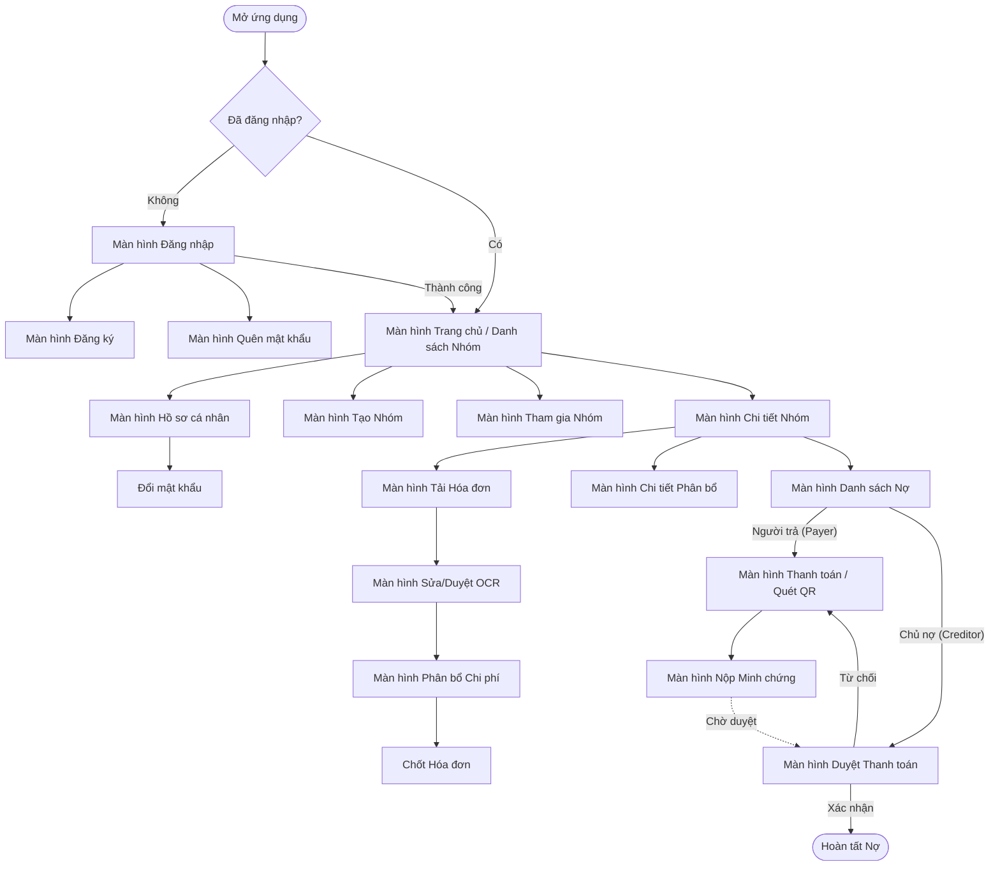

## 1. Danh sách các màn hình (Screens)

Các màn hình của ứng dụng được trích xuất từ các Use Case và luồng người dùng:

- **Nhóm màn hình Xác thực & Tài khoản (Guest / Authenticated User):**
- Màn hình Đăng nhập (Sign In).

- Màn hình Đăng ký (Sign Up).

- Màn hình Quên mật khẩu (Forgot Password).

- Màn hình Cập nhật Hồ sơ cá nhân (Update Profile Information) bao gồm thông tin cá nhân và tài khoản ngân hàng mặc định.

- Màn hình Đổi mật khẩu (Change Password).

- **Nhóm màn hình Quản lý Nhóm (Group Management):**
- Màn hình Trang chủ (Home) hiển thị danh sách các nhóm tham gia.

- Màn hình Tạo nhóm mới (Create New Group).

- Màn hình Tham gia nhóm (Join Group) thông qua nhập mã mời hoặc link.

- Màn hình Chi tiết nhóm (Group Summary) hiển thị thành viên, lịch sử hoạt động và danh sách hóa đơn.

- **Nhóm màn hình Hóa đơn & Phân bổ (Bill Processing & Expense Allocation):**
- Màn hình Tải ảnh hóa đơn (Upload Bill Image).

- Màn hình Xét duyệt và chỉnh sửa hóa đơn (Review & Update Bill Information) sau khi OCR quét xong.

- Màn hình Phân bổ chi phí (Assign Items to Members) cho phép chia đều hoặc chia theo từng món.

- Màn hình Chi tiết khoản chi phí được phân bổ (View Allocated Expense) hiển thị chi tiết số tiền phải trả.

- **Nhóm màn hình Công nợ & Thanh toán (Debt & Payment Workflow):**
- Màn hình Danh sách Công nợ (Debt List) hiển thị ai nợ ai.

- Màn hình Thanh toán (Payment Screen) hiển thị mã VietQR với số tiền chính xác.

- Màn hình Nộp minh chứng (Submit Payment Proof) để tải ảnh giao dịch.

- Màn hình Chờ xác nhận (Pending Confirmation) dành cho Chủ nợ xét duyệt hoặc từ chối.

- **Nhóm màn hình Quản trị (Admin):**
- Màn hình Danh sách tài khoản (View List Account).

- Màn hình Chi tiết tài khoản (View Account Details).

- Màn hình Giám sát hệ thống (System Monitoring Dashboard).

---

## 2. Sơ đồ Luồng màn hình (Screen Flow)

---

## 3. Phân chia Module Backend & Danh sách API

Dựa trên thiết kế kiến trúc phần mềm (High-Level Architecture) và thiết kế cơ sở dữ liệu (Database Schema), Backend được chia thành 6 module cốt lõi.

### Module 1: Auth & User (Xác thực và Người dùng)

Quản lý đăng nhập, đăng ký, phiên hoạt động (sessions) và hồ sơ cá nhân.

- **`POST /api/auth/sign-in`**: Xác thực email/password, trả về access token và refresh token (4.1.1).

- **`POST /api/auth/sign-up`**: Tạo tài khoản mới và gửi email xác thực (4.1.2).

- **`POST /api/auth/forgot-password`**: Tạo token đặt lại mật khẩu và gửi qua email (4.1.3).

- **`POST /api/auth/sign-out`**: Thu hồi refresh token của thiết bị hiện tại (4.1.4).

- **`PUT /api/user/password`**: Thay đổi mật khẩu người dùng (4.1.5).

- **`PUT /api/user/profile`**: Cập nhật tên, avatar, số điện thoại và thông tin tài khoản ngân hàng mặc định (4.1.6).

### Module 2: Group (Quản lý Nhóm)

Xử lý vòng đời của nhóm chi tiêu, thành viên và tạo mã mời.

- **`POST /api/groups`**: Tạo nhóm chi tiêu mới và gán quyền Captain (4.1.7).

- **`GET /api/groups`**: Lấy danh sách các nhóm mà người dùng đang tham gia.

- **`POST /api/groups/{id}/invites`**: Trả về mã mời (invite code) hoặc deep link tham gia nhóm (4.1.8).

- **`POST /api/groups/join`**: Thêm người dùng vào nhóm thông qua mã mời (4.1.9).

- **`DELETE /api/groups/{id}/members/{memberId}`**: Xóa thành viên khỏi nhóm (chỉ thành công khi công nợ bằng 0) (4.1.10).

- **`GET /api/groups/{id}/activities`**: Truy xuất nhật ký hoạt động (activity log) của nhóm.

### Module 3: Bill & OCR (Hóa đơn & Trích xuất dữ liệu)

Điều phối việc tải ảnh, gọi dịch vụ Vision LLM/OCR để bóc tách dữ liệu và lưu trữ thông tin món ăn.

- **`POST /api/groups/{id}/bills/upload`**: Tải ảnh receipt lên storage, tạo bản nháp (draft) và đẩy job OCR vào hàng đợi (4.1.11).

- **`GET /api/groups/{id}/bills/{billId}`**: Lấy chi tiết hóa đơn (Sử dụng SSE để client theo dõi tiến trình OCR) (4.1.12).

- **`PUT /api/groups/{id}/bills/{billId}`**: Cập nhật, chỉnh sửa thông tin hóa đơn (sửa lỗi OCR) (4.1.14).

- **`POST /api/groups/{id}/bills/{billId}/assignments`**: Phân bổ từng line item cho các thành viên hoặc chia đều (4.1.13).

- **`POST /api/groups/{id}/bills/{billId}/finalize`**: Chốt hóa đơn (immutable), tính toán tự động số tiền thực tế mỗi người phải trả và tạo bản ghi nợ (4.1.15).

### Module 4: Split & Settlement (Công nợ & Thanh toán)

Quản lý vòng đời công nợ (`awaiting` → `pending_confirmation` → `settled`/`rejected`), sinh mã VietQR và xác nhận thanh toán.

- **`GET /api/groups/{id}/expenses/me`**: Liệt kê chi tiết các khoản chi đã được phân bổ cho người dùng (4.1.16).

- **`GET /api/groups/{id}/debts`**: Lấy danh sách công nợ tổng hợp (ai nợ ai) trong nhóm.

- **`POST /api/groups/{id}/payments/qr`**: Gom các khoản nợ của cùng một chủ nợ và sinh mã VietQR thanh toán (4.1.17).

- **`POST /api/groups/{id}/payments/{paymentId}/proof`**: Tải lên hình ảnh minh chứng chuyển khoản, đổi trạng thái nợ thành chờ xác nhận (4.1.18).

- **`POST /api/groups/{id}/payments/{paymentId}/confirm`**: Chủ nợ xác nhận đã nhận tiền, chốt sổ công nợ (4.1.19).

- **`POST /api/groups/{id}/payments/{paymentId}/reject`**: Chủ nợ từ chối khoản thanh toán kèm lý do, trả nợ về trạng thái chờ (4.1.19).

### Module 5: Admin (Quản trị Hệ thống)

Module dành riêng cho người vận hành để kiểm soát nền tảng và người dùng.

- **`GET /api/v1/admin/accounts`**: Phân trang, tìm kiếm và lọc danh sách toàn bộ tài khoản (4.1.20).

- **`GET /api/v1/admin/accounts/{id}`**: Xem chi tiết hồ sơ và lịch sử hoạt động của một tài khoản (4.1.21).

- **`PUT /api/v1/admin/accounts/{id}/status`**: Cập nhật trạng thái tài khoản (đình chỉ, khóa, kích hoạt lại) (4.1.22).

- **`GET /health`**, **`GET /health/ready`** & **`GET /metrics`**: Giám sát tình trạng hệ thống, hàng đợi job (River queue) và hiệu suất API (4.1.23).

- **`GET /api/v1/admin/system/overview`**: Tổng quan thống kê nền tảng cho dashboard quản trị (4.1.23).

### Module 6: Notification & Background Queue (Thông báo & Hàng đợi ngầm)

Quản lý thông báo in-app, push notification qua Firebase Cloud Messaging (FCM), và xử lý tác vụ nền bất đồng bộ với River Queue.

- **`PUT /api/v1/users/me/fcm-token`**: Cập nhật FCM token thiết bị cho phiên đăng nhập hiện tại.

- **`GET /api/v1/notifications`**: Lấy danh sách thông báo in-app của người dùng có phân trang.

- **`GET /api/v1/notifications/unread-count`**: Đếm số lượng thông báo chưa đọc.

- **`PATCH /api/v1/notifications/{id}/read`**: Đánh dấu 1 thông báo cụ thể là đã đọc.

- **`PATCH /api/v1/notifications/read-all`**: Đánh dấu tất cả thông báo của người dùng là đã đọc.

