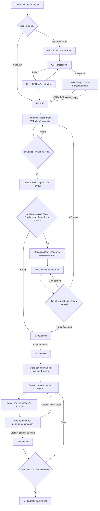
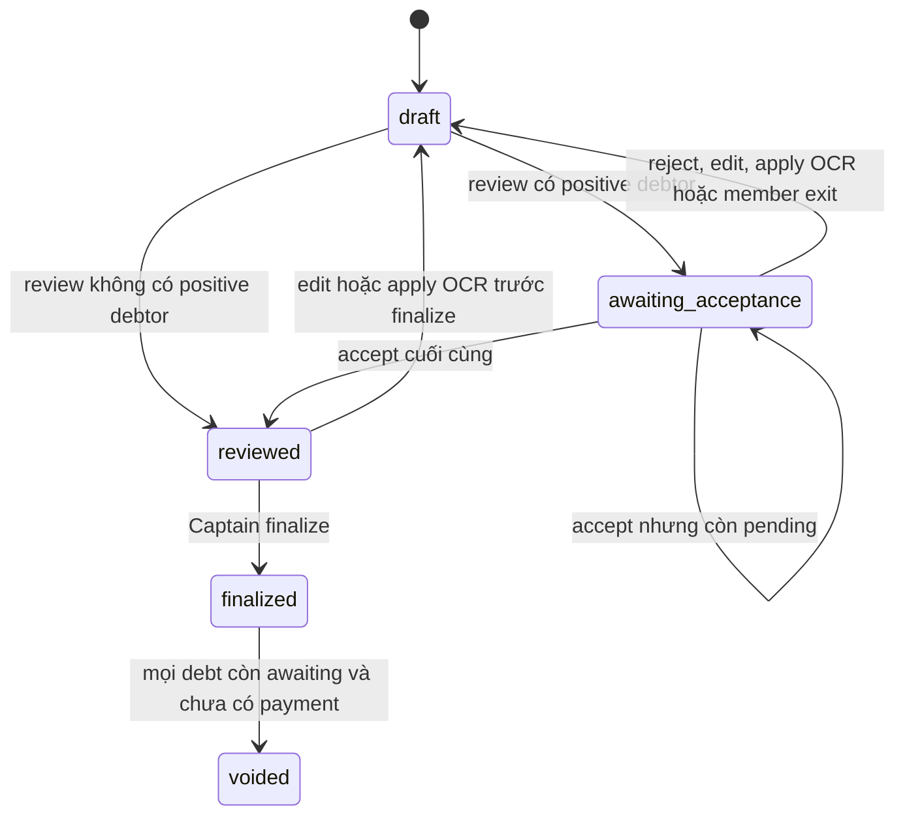
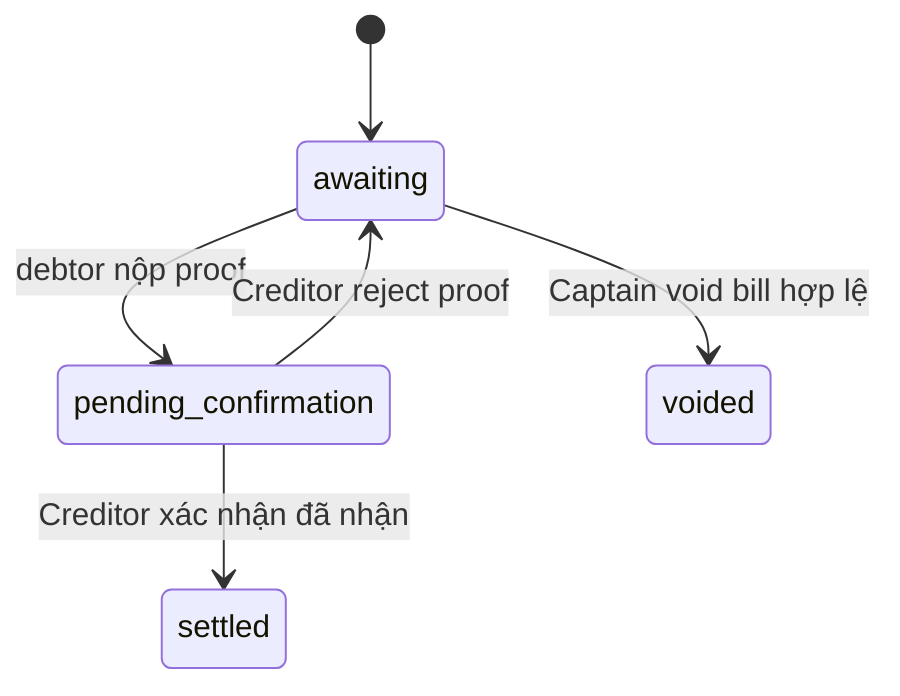

<!-- Hallmark · pre-emit critique: P5 H5 E5 S5 R5 V5 -->
# Luồng đầu cuối V2 từ tải bill đến tất toán

**Ngày**: 2026-08-24
**Trạng thái**: Proposed
**Target release**: V2
**Phạm vi**: Bill OCR, chia tiền, xác nhận phần chia, tạo công nợ và thanh toán ngang hàng

## 1. Mục đích

Tài liệu này mô tả một bill từ lúc người dùng tải ảnh hoặc nhập tay cho đến khi mọi khoản nợ do bill tạo ra đã được chủ nợ xác nhận là thanh toán xong.

> Tài liệu này chỉ áp dụng cho V2. V1 không có debtor consent. Luồng V1 dùng khóa gửi bill và chốt hàng loạt tại [spec 0008](../0008-group-bill-close-v1/index.md).

Hai mốc nghiệp vụ cần phân biệt rõ:

1. **Chia tiền thành công** nghĩa là Captain đã finalize bill sau khi mọi con nợ bắt buộc đồng ý đúng version. Lúc này share và debt chính thức mới được tạo.
2. **Trả nợ xong** nghĩa là mọi debt của bill đã chuyển sang `settled` sau khi chủ nợ xác nhận tiền đã đến. Việc debtor accept phần chia không phải là bằng chứng thanh toán.

Tài liệu này ghép ba hợp đồng:

1. [Bill and OCR v1](../0003-bill-ocr-v1/index.md)
2. [Debtor bill consent](index.md)
3. [Split and settlement v1](../0004-split-settlement-v1/index.md)

## 2. Sơ đồ luồng chính

## 3. Trách nhiệm theo vai trò

| Vai trò | Có thể làm | Không thể làm |
|---|---|---|
| Thành viên active | Tạo bill, xem bill trong nhóm, xem phần chia của mình | Sửa bill của người khác nếu không phải Captain, xem ma trận consent nếu không được cấp quyền |
| Creditor | Sửa draft bill của mình, apply OCR, review, xem consent round, nhắc người còn pending, xem lý do reject | Finalize nếu không đồng thời là Captain, tự accept thay con nợ |
| Captain | Sửa draft, review, xem consent round, nhắc pending, finalize khi đủ điều kiện | Bỏ qua request pending hoặc ép accept |
| Debtor có `proposed_amount > 0` | Xem snapshot phần chia của mình, accept hoặc reject đúng version | Rút lại accept, sửa snapshot, phản hồi thay người khác |
| Thành viên có phần trả bằng `0 VND` | Xem bill theo quyền đọc hiện tại | Nhận request consent không cần thiết |

Creditor không nhận request cho phần tự chịu của chính họ. Consent chỉ áp dụng cho thành viên khác Creditor có `proposed_amount > 0`.

## 4. Luồng chi tiết

### 4.1. Tạo bill và OCR

1. Một thành viên active tạo bill và trở thành Creditor.
2. Người tạo có thể nhập tay hoặc tải từ 1 đến 5 ảnh JPEG, PNG hoặc HEIC, tối đa 10 MB mỗi ảnh.
3. Bill ảnh được tạo ở `draft`, OCR chạy bất đồng bộ qua River với trạng thái `queued`, `processing`, `succeeded` hoặc `failed`.
4. OCR thành công chỉ tạo candidate. Candidate không tự ghi đè draft.
5. Creditor hoặc Captain kiểm tra candidate rồi apply bằng đúng `version` hiện tại.
6. Apply OCR thay nội dung draft, tăng version, xóa assignment cũ và xóa hiệu lực review hiện tại.
7. OCR thất bại không khóa bill. Người dùng có thể retry hoặc tiếp tục nhập tay.

### 4.2. Hoàn thiện draft và tính phần chia

Creditor hoặc Captain hoàn thiện các dữ liệu sau:

1. Merchant, ngày bill và tổng tiền báo cáo.
2. Danh sách item, số lượng, đơn giá, giá gốc, giảm giá item và giá sau giảm.
3. Người được assign trên từng item và tỷ lệ chia.
4. Phí dịch vụ, VAT và voucher chung.
5. Creditor đã trả trước và tài khoản ngân hàng hợp lệ để nhận tiền sau finalize.

Backend luôn là nguồn tính tiền cuối cùng. Review bị chặn khi còn item chưa assign, tỷ lệ không đủ 100 phần trăm, thành viên không còn active, tiền âm, quá giới hạn item hoặc tổng tính toán không khớp tổng bill.

### 4.3. Review và tạo vòng xác nhận

Khi Creditor hoặc Captain bấm `review`, backend khóa bill và kiểm tra đúng version:

1. Chạy lại phép phân bổ hiện tại.
2. Lọc mọi thành viên active khác Creditor có final amount lớn hơn `0 VND`.
3. Nếu danh sách rỗng, bill chuyển thẳng sang `reviewed` và không tạo consent round.
4. Nếu có debtor, backend tạo một `bill_acceptance_round`, một request cho mỗi debtor và snapshot bất biến của phần người đó nhìn thấy.
5. Snapshot lưu item được assign, giá ban đầu, giá sau giảm, tỷ lệ, phần item, phí dịch vụ, VAT, voucher, rounding và `proposed_amount` cuối cùng.
6. Bill chuyển sang `awaiting_acceptance` và gửi notification cho từng debtor.

### 4.4. Debtor accept hoặc reject

Trang xác nhận có hai tab:

1. `Chờ xác nhận` chứa request `pending` còn hiệu lực.
2. `Đã phản hồi` chứa lịch sử `accepted` và `rejected` của các nhóm vẫn active.

Debtor có thể chọn tối đa 50 bill và gửi batch. Mỗi bill được xử lý bằng transaction độc lập.

Khi accept:

1. Debtor xác nhận đúng `request_id` và `bill_version`.
2. Accept có hiệu lực ngay khi commit và không thể rút lại trên version đó.
3. Nếu còn người pending, bill tiếp tục `awaiting_acceptance`.
4. Nếu đây là accept cuối, round chuyển `approved` và bill chuyển `reviewed` trong cùng transaction.

Khi reject:

1. Lý do sau trim phải dài từ 1 đến 500 ký tự.
2. Request của người phản hồi chuyển `rejected`.
3. Cả round chuyển `rejected`, bill quay về `draft`.
4. Mọi accept trước đó được giữ để audit nhưng không còn hiệu lực.
5. Creditor, Captain và mọi debtor trong round nhận thông báo version đã bị từ chối. Chỉ rejector, Creditor và Captain được đọc lý do.

Batch trả `200` khi mọi item thành công. Nếu có bất kỳ item hợp lệ nào thất bại, API trả `207 Multi Status` với kết quả riêng cho từng bill. Thành công không bị rollback vì bill khác thất bại.

### 4.5. Sửa bill sau khi đã gửi xác nhận

Creditor hoặc Captain có thể sửa bằng `PUT /bills/{id}` với đúng version kể cả khi bill đang `awaiting_acceptance` hoặc đã `reviewed` nhưng chưa finalize.

Một thay đổi làm biến đổi ý nghĩa bill sẽ:

1. Tăng version.
2. Chuyển round hiện tại sang `invalidated`.
3. Giữ toàn bộ request và response cũ để audit.
4. Đưa bill về `draft`.
5. Yêu cầu bấm review lại và mọi debtor của version mới phản hồi lại.

Cùng quy tắc này áp dụng khi apply OCR hoặc khi một member liên quan rời hoặc bị xóa khỏi nhóm trước khi round hoàn tất.

### 4.6. Chờ phản hồi và nhắc

Bill không có hạn tự accept và không tự hết hạn. Nếu một người không phản hồi, bill ở `awaiting_acceptance` vô thời hạn và Captain không thể finalize.

Creditor hoặc Captain có thể bấm `Nhắc tất cả` trên bill. Backend chỉ gửi cho request còn `pending`, tối đa ba lần cho mỗi request và cách nhau ít nhất 24 giờ. Người đã accept không nhận nhắc lại.

### 4.7. Finalize và tạo công nợ

Chỉ Captain được finalize. Backend khóa và kiểm tra lại:

1. Bill ở `reviewed`.
2. Version khớp.
3. Có approved round đúng version nếu bill cần consent.
4. Mọi positive debtor share tính lại bằng chính xác `proposed_amount` họ đã accept.
5. Assignment, tổng tiền, membership và tài khoản nhận tiền của Creditor vẫn hợp lệ.

Nếu mọi kiểm tra đạt, một transaction tạo share bất biến và debt `awaiting` cho từng non Creditor có amount lớn hơn `0 VND`. Đây là thời điểm chia tiền thành công. Không debt nào được tạo ở bước review hoặc accept.

### 4.8. VietQR, proof và xác nhận đã nhận tiền

Sau finalize, luồng settlement hiện tại tiếp tục không đổi:

1. Debtor xem các debt `awaiting` và chọn một hoặc nhiều debt cùng Creditor.
2. Backend tạo payment `pending_proof`, reference code và Dynamic VietQR. Tổng QR bằng tổng debt được chọn.
3. Tiền chuyển trực tiếp từ tài khoản debtor sang tài khoản Creditor. PaySplit không giữ tiền.
4. Debtor tải proof và có thể thêm ghi chú. Payment cùng các debt chuyển `pending_confirmation`.
5. Creditor kiểm tra tài khoản ngân hàng và proof.
6. Nếu xác nhận đã nhận đủ, payment thành `confirmed` và mọi debt liên kết thành `settled`.
7. Nếu reject proof với lý do hợp lệ, payment thành `rejected`, debt quay về `awaiting`, debtor tạo lại QR hoặc nộp proof mới.
8. Khi mọi debt do bill tạo ra đều `settled`, bill đạt mốc trả nợ xong.

## 5. Sơ đồ trạng thái

## 6. Trường hợp biên và kết quả mong đợi

### 6.1. Tải ảnh và OCR

| Trường hợp | Kết quả |
|---|---|
| Không có ảnh hoặc nhiều hơn 5 ảnh trong luồng OCR | Từ chối request, không tạo OCR job |
| Sai định dạng hoặc ảnh lớn hơn 10 MB | Trả lỗi ảnh, không áp dụng dữ liệu một phần |
| Upload ngoài thất bại sau khi đã tạo operation | Cleanup object theo operation hoặc đưa vào media cleanup job |
| OCR chạy trùng | Chỉ một job `queued` hoặc `processing` được phép trên một bill |
| OCR thất bại hết retry | Giữ draft, cho retry thủ công hoặc nhập tay |
| Draft đổi sau khi OCR bắt đầu | Apply candidate trả `OCR_RESULT_STALE` |
| Candidate có dòng khuyến mãi item | Gộp vào item trước; dòng khuyến mãi mồ côi trở thành voucher chung kèm warning |

### 6.2. Draft và review

| Trường hợp | Kết quả |
|---|---|
| Tổng item và tổng bill lệch | Lưu draft được, review bị chặn |
| Item chưa assign hoặc tỷ lệ không đủ | Review bị chặn |
| Assignee đã inactive | Review bị chặn và yêu cầu sửa assignment |
| Debtor final amount bằng `0 VND` | Không tạo request và không tạo debt |
| Chỉ Creditor chịu toàn bộ bill | Chuyển thẳng `reviewed` |
| Creditor thiếu tài khoản ngân hàng hợp lệ | Finalize bị chặn trước khi tạo debt |
| Hai người cùng review một version | Commit đầu thắng, request sau nhận conflict hoặc replay idempotent |
| Xóa draft chưa từng có consent | Cho phép theo luồng hiện tại |
| Xóa draft đã có consent history | Trả `409 CONSENT_HISTORY_EXISTS` |

### 6.3. Consent

| Trường hợp | Kết quả |
|---|---|
| Debtor phản hồi version cũ | `ACCEPTANCE_VERSION_STALE`, không ghi response |
| Debtor bấm accept hai lần | Lần commit đầu thắng, lần sau `ALREADY_RESPONDED` hoặc replay cùng idempotency key |
| Accept và reject đồng thời trên cùng request | Transaction commit đầu thắng |
| Accept cuối cùng chạy đồng thời với edit | Chỉ một trạng thái hợp lệ commit; thao tác còn lại nhận version hoặc state conflict |
| Một người reject sau khi người khác accept | Bill về `draft`, mọi accept cũ thành lịch sử không hiệu lực |
| Reject toàn khoảng trắng hoặc dài hơn 500 ký tự | Item reject thất bại, bill khác trong batch vẫn được xử lý |
| Batch có bill hợp lệ và bill stale | Trả `207`; bill hợp lệ commit, bill stale giữ lại để xử lý lỗi |
| Không ai phản hồi | Bill ở `awaiting_acceptance`, không tự accept, không hết hạn, không finalize |
| Captain muốn bỏ qua một người | Không có override |
| Thành viên rời nhóm khi pending hoặc đã accept | Invalidate round bị ảnh hưởng, bill về `draft`, không chặn việc rời |
| Group bị archive | User API trả not found và không cho xem cả lịch sử consent |
| User khác đoán được request ID | Trả not found, không lộ request tồn tại |

### 6.4. Finalize và sửa sau review

| Trường hợp | Kết quả |
|---|---|
| Finalize khi còn pending | `CONSENT_REQUIRED`, không tạo share hoặc debt |
| Finalize sau round rejected hoặc invalidated | `CONSENT_REQUIRED` |
| Số tiền tính lại khác số đã accept | `CONSENT_REQUIRED`, yêu cầu sửa và review version mới |
| Edit bill đã `reviewed` nhưng chưa finalize | Invalidate round, tăng version, về `draft` |
| Finalize lặp cùng idempotency key | Replay kết quả cũ |
| Finalize đồng thời từ hai thiết bị | Chỉ một transaction tạo share và debt |
| Bill đã finalized cần sửa | Không sửa trực tiếp; chỉ void hợp lệ rồi tạo replacement bill |

### 6.5. Thanh toán và tất toán

| Trường hợp | Kết quả |
|---|---|
| Chọn debt thuộc nhiều Creditor trong một QR | Từ chối; mỗi payment chỉ có một Creditor |
| Debt không còn `awaiting` khi tạo QR | `DEBTS_NOT_AWAITING` |
| Creditor thiếu hoặc đổi tài khoản trước proof | Pending QR dùng thông tin mới; thiếu tài khoản thì chặn cho đến khi sửa |
| Creditor đổi tài khoản sau proof | Giữ snapshot tài khoản tại lúc proof được nộp |
| Upload proof lỗi | Payment và debt không chuyển trạng thái; cleanup object của attempt |
| Creditor chưa duyệt proof sau 48 giờ | Gửi cảnh báo stalled một lần; không tự settle |
| Creditor reject proof | Toàn bộ debt của payment quay lại `awaiting` |
| Một payment gộp nhiều debt được confirm | Tất cả debt liên kết settle cùng transaction |
| Một số debt của bill đã settled, số khác chưa | Bill chưa được coi là trả nợ xong |
| Bill không tạo debt vì chỉ Creditor chịu tiền | Chia tiền thành công ngay sau finalize và không có bước thu nợ |
| Captain void khi mọi debt còn awaiting, chưa payment | Bill và debt chuyển `voided`, giữ audit |
| Captain void khi proof đã nộp hoặc payment đã bắt đầu | Trả `PAYMENT_ALREADY_STARTED` |

## 7. Notification theo mốc

| Mốc | Người nhận |
|---|---|
| Review tạo consent round | Mỗi debtor có request pending |
| Nhắc consent | Chỉ debtor còn pending và còn quota |
| Một người reject | Creditor, Captain và mọi debtor của round; lý do chỉ tới người có quyền |
| Bill bị sửa hoặc member exit làm invalidated | Mọi người đã tham gia round cũ |
| Đủ accept | Creditor và Captain biết bill đã sẵn sàng finalize |
| Finalize | Thành viên liên quan nhận thông tin share hoặc debt theo luồng hiện tại |
| Tạo payment hoặc nộp proof | Creditor liên quan |
| Creditor confirm hoặc reject payment | Debtor liên quan |

## 8. Điều kiện hoàn thành đầu cuối

Luồng hoàn thành khi thỏa một trong hai điều kiện:

1. Bill finalized không tạo debt vì không có non Creditor share lớn hơn `0 VND`.
2. Bill finalized có debt và mọi debt đó đều ở `settled`.

Bill `voided`, consent round `rejected` hoặc payment `rejected` là trạng thái có dấu vết, không phải hoàn thành thành công.
