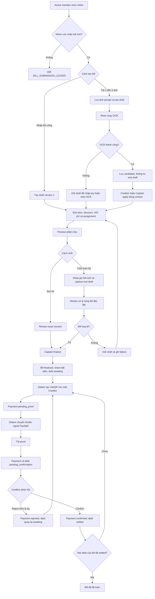

# Luồng V1 từ tải bill đến tất toán

**Ngày**: 2026-08-24
**Trạng thái**: Proposed
**Phạm vi**: Tạo bill, OCR, chia tiền, khóa gửi bill, chốt đơn lẻ, chốt hàng loạt, tạo công nợ, VietQR, proof thanh toán và xác nhận tất toán
**Spec chính**: [Group bill close v1](index.md)
**Bill và OCR**: [Bill and OCR v1](../0003-bill-ocr-v1/index.md)
**Thanh toán**: [Split and Settlement v1](../0004-split-settlement-v1/index.md)

## 1. Mục đích

Tài liệu này mô tả luồng V1 từ lúc một thành viên tải ảnh hóa đơn hoặc nhập bill thủ công cho đến khi mọi khoản nợ của bill đã được chủ nợ xác nhận là thanh toán xong.

V1 không có bước con nợ accept hoặc reject phần chia. Khi Captain finalize, hệ thống tạo share và debt ngay theo dữ liệu đã review. Luồng debtor consent được để sang V2 và không được dùng để chặn review, finalize đơn lẻ hoặc finalize hàng loạt trong V1.

PaySplit chỉ điều phối dữ liệu và bằng chứng thanh toán. Tiền được chuyển trực tiếp giữa tài khoản ngân hàng của các thành viên. PaySplit không giữ hoặc chuyển tiền thay người dùng.

## 2. Ba mốc nghiệp vụ cần phân biệt

| Mốc | Điều kiện | Kết quả |
|---|---|---|
| Chia tiền hợp lệ | Draft có item, assignment và tổng tiền hợp lệ | Bill có thể được review. Tài khoản chủ nợ được kiểm tra ở finalize |
| Chia tiền thành công | Captain finalize đúng version đã review, hoặc batch review và finalize draft hợp lệ | Bill thành `finalized`, share bất biến được lưu, debt dương được tạo ở trạng thái `awaiting` |
| Tất toán bill | Mọi debt còn hiệu lực do bill tạo ra đều là `settled` | Không còn khoản phải trả của bill. Bill vẫn giữ status `finalized`, trạng thái tất toán được suy ra từ debt |

Bill `voided` là bill bị hủy có dấu vết. Đây không phải là bill đã thanh toán. Debt `voided` không còn là nghĩa vụ và không được tính vào số dư còn nợ.

## 3. Vai trò

| Vai trò | Quyền chính trong luồng |
|---|---|
| Active member | Tạo bill mới khi nhóm còn mở, xem bill và phần chia trong nhóm |
| Creditor | Người tạo bill và là người đã trả trước. Có thể sửa draft của mình, chạy OCR, apply kết quả OCR và review. Không được finalize nếu không đồng thời là current Captain |
| Captain | Có thể sửa hoặc review draft. Đây là vai trò duy nhất được finalize một bill, khóa gửi bill mới, chốt toàn bộ, void bill đủ điều kiện và nhắc debt |
| Debtor hoặc Payer | Thành viên có phần phải trả lớn hơn `0 VND`. Xem debt, tạo VietQR, chuyển tiền ngoài PaySplit và tải proof |
| Creditor của payment | Xác nhận đã nhận tiền hoặc reject proof kèm lý do |
| River worker | Chạy OCR, batch finalize, notification, reminder và cleanup bền vững |

Quy tắc quyền quan trọng là quyền sở hữu bill của Creditor tách biệt với quyền quản trị của Captain. Review của Creditor không cấp quyền finalize. Nếu cùng một người vừa là Creditor vừa là current Captain, người đó được finalize vì đang giữ vai trò Captain.

## 4. Sơ đồ tổng thể



## 5. Các state machine của V1

### 5.1 Trạng thái nhận bill của nhóm

```text
open -> locked
```

`open` nghĩa là thành viên active có thể tạo bill. `locked` nghĩa là mọi thành viên, kể cả Captain, không thể tạo bill mới.

V1 không có `locked -> open`. Khóa chỉ ngăn bill mới. Draft đã tồn tại vẫn được sửa, review, xóa hoặc finalize theo quyền hiện tại.

### 5.2 Bill và review

```text
draft chưa review -> draft đã review -> finalized -> voided
draft -> deleted
```

Review không phải một giá trị riêng của `bills.status`. Bill đã review vẫn có status `draft`. Review được xác định bằng review fields của đúng version hiện tại.

Bất kỳ thay đổi nào làm thay đổi ý nghĩa tài chính đều tăng `version` và xóa review. Ví dụ gồm sửa item, assignment, VAT, phí, discount hoặc apply OCR candidate.

Bill `finalized` không được sửa. Mọi mutation làm thay đổi nội dung phải trả `409 BILL_IMMUTABLE`.

### 5.3 OCR job

```text
queued -> processing -> succeeded
queued -> processing -> failed
succeeded -> applied
```

`succeeded` chỉ có nghĩa là đã có candidate OCR. Draft chưa thay đổi cho đến khi Creditor hoặc Captain apply candidate bằng đúng bill version.

### 5.4 Batch chốt toàn bộ

```text
batch: queued -> processing -> completed
item: pending -> finalized
item: pending -> failed
```

Một nhóm chỉ có tối đa một batch `queued` hoặc `processing`. Mỗi bill là một item độc lập. Một item thất bại không rollback item đã finalize thành công.

### 5.5 Debt

```text
awaiting -> pending_confirmation -> settled
pending_confirmation -> awaiting
awaiting -> voided
```

Debt chỉ được tạo khi bill finalize. Reject payment đưa debt từ `pending_confirmation` về `awaiting`. Void bill chỉ được phép khi debt vẫn `awaiting` và chưa gắn payment.

### 5.6 Payment

```text
pending_proof -> pending_confirmation -> confirmed
pending_confirmation -> rejected
pending_proof -> superseded
```

Payment `confirmed` làm toàn bộ debt mà payment bao phủ thành `settled` trong cùng transaction. V1 không xác nhận một phần payment.

## 6. Giai đoạn 1, tạo bill

### 6.1 Điều kiện đầu vào

Backend kiểm tra các điều kiện sau:

1. Access token và session còn hiệu lực.
2. `group_id` tồn tại và group còn active.
3. Caller là active member của group.
4. `bill_submission_locked_at` của group là null.
5. `Idempotency-Key` chưa được dùng cho request có nội dung khác.

Nếu group đã khóa, `POST /api/v1/bills` trả `409 BILL_SUBMISSION_LOCKED` cho cả JSON thủ công và multipart ảnh.

### 6.2 Tạo thủ công

Client gửi `POST /api/v1/bills` bằng JSON có `group_id`. Backend tạo bill với:

1. `status = draft`.
2. `version = 1`.
3. Caller là `creditor_member_id` và không thể đổi sau đó.
4. Item, money fields và assignment theo request đã validate.
5. Response `201` cùng preview và reconciliation hiện tại.

### 6.3 Tạo từ ảnh

Client gửi cùng endpoint bằng multipart với `group_id` và từ một đến năm ảnh JPEG, PNG hoặc HEIC. Mỗi ảnh tối đa 10 MB.

Backend thực hiện:

1. Kiểm tra quyền và lock state trước upload để fail sớm.
2. Dành một operation ID cho idempotency attempt.
3. Chuẩn hóa hướng ảnh và tải object private lên Cloudinary bằng key của attempt.
4. Mở transaction, khóa active group và kiểm tra lock state lần nữa.
5. Tạo draft, `bill_images`, OCR job và River job trong cùng quyết định dữ liệu.
6. Trả `202` với bill ID, version và OCR job.

Nếu Captain khóa group trong lúc upload, chỉ một bên được commit. Nếu lock thắng, không có bill hoặc OCR job. Object của attempt được xóa ngay hoặc đi vào `media_cleanup_jobs` để worker dọn lại.

## 7. Giai đoạn 2, OCR và apply candidate

River lấy OCR job `queued`, chuyển sang `processing` rồi gửi các ảnh theo đúng position tới LlamaExtract.

Candidate chuẩn hóa gồm merchant, ngày, item, phí dịch vụ, VAT, discount, total, warning và confidence. Raw provider data không được trả ra mobile hoặc ghi vào log.

Khi OCR thành công:

1. Job chuyển sang `succeeded`.
2. Candidate được lưu cạnh `bill_version_at_start`.
3. Draft, item và assignment hiện tại chưa đổi.
4. SSE báo `ocr.updated` để mobile refresh.
5. Creditor hoặc Captain xem candidate rồi apply bằng đúng version.

Apply candidate thay toàn bộ dữ liệu draft liên quan, xóa assignment cũ, tăng bill version và xóa review. Nếu draft đã đổi kể từ lúc OCR bắt đầu, backend trả `409 OCR_RESULT_STALE` và không ghi đè chỉnh sửa của người dùng.

Khi OCR thất bại sau các lần retry, draft vẫn mở để nhập tay. Creditor hoặc Captain có thể retry OCR trong giới hạn hiện tại.

## 8. Giai đoạn 3, sửa draft và chia tiền

Creditor của bill hoặc Captain dùng `PUT /api/v1/bills/{billId}?group_id={groupId}` với đúng `version`.

### 8.1 Tiền của item và bill

Backend giữ toàn bộ tiền bằng số nguyên VND:

```text
item.final_price = item.line_total - item.discount_amount
bill.total_item_discount = sum(item.discount_amount)
bill.general_discount = bill.discount - bill.total_item_discount
bill.computed_total = bill.subtotal - bill.discount + bill.service_charge + bill.vat
```

Review yêu cầu `bill.subtotal = sum(item.line_total)` và reported total bằng `computed_total`.

Khuyến mãi riêng của item chỉ có lợi cho những thành viên được assign item đó. `general_discount` mới được phân bổ ở cấp bill.

### 8.2 Assignment

Mỗi item phải có ít nhất một active member. Tỷ lệ của item phải lớn hơn 0, không lớn hơn 1 và tổng chính xác bằng `1.00000000`.

Equal split chỉ là thao tác tiện ích để ghi các tỷ lệ bằng nhau. Backend vẫn lưu assignment rõ ràng cho từng item và member.

### 8.3 Preview

Preview và finalize dùng cùng một hàm chia tiền:

1. Chia `final_price` của từng item theo assignment.
2. Chia phí dịch vụ, VAT và `general_discount` theo phần item của từng người.
3. Floor từng thành phần về VND nguyên.
4. Creditor hấp thụ mọi phần VND không chia hết.
5. Tổng `final_amount` của mọi member phải bằng bill total.
6. Member có `final_amount = 0` vẫn có share snapshot sau finalize nhưng không có debt.

Nếu subtotal bằng 0, phí dịch vụ và VAT thuộc Creditor.

## 9. Giai đoạn 4, review

Review là xác nhận của Creditor hoặc Captain rằng draft version hiện tại đã đủ điều kiện để finalize. Endpoint là `POST /api/v1/bills/{billId}/review?group_id={groupId}`.

Backend khóa bill và kiểm tra:

1. Version đúng.
2. Bill vẫn là `draft`.
3. Item, assignment và active member hợp lệ.
4. Reported subtotal và total khớp số server tính.
5. Phân bổ không tạo phần tiền âm.

Review thành công ghi reviewer và review time trên version hiện tại. Review không phải finalize, không tạo share hoặc debt, và không có request debtor consent trong V1. Creditor review xong vẫn phải chờ current Captain finalize.

Một semantic edit hoặc apply OCR sau review sẽ tăng version và xóa review. Creditor hoặc Captain phải review version mới, sau đó current Captain mới được finalize đơn lẻ.

## 10. Giai đoạn 5, khóa gửi bill mới

Captain có thể gọi `POST /api/v1/groups/{groupId}/bills/lock-submissions` mà không cần chạy bulk finalize.

Khi thành công:

1. Backend khóa active group row.
2. Ghi `bill_submission_locked_at` bằng PostgreSQL time nếu chưa có.
3. Ghi một activity `bill_submission_locked`.
4. Mọi create bill sau đó bị từ chối.
5. Bill list, Bill Detail, OCR, draft edit, review, finalize và settlement vẫn hoạt động.

Gọi lại bằng cùng request hợp lệ là idempotent. V1 không có API mở khóa.

## 11. Giai đoạn 6A, finalize một bill

Captain gọi `POST /api/v1/bills/{billId}/finalize?group_id={groupId}` với version đã review và `Idempotency-Key`.

Creditor không phải current Captain gọi endpoint này sẽ nhận `403 FORBIDDEN`, kể cả khi chính họ tạo và review bill. Request bị từ chối không thay đổi bill, không tạo share và không tạo debt.

Trong một transaction ngắn, backend:

1. Khóa active group rồi khóa bill.
2. Xác nhận caller là current Captain.
3. Kiểm tra status, exact version và review fields.
4. Kiểm tra reconciliation, assignment, active assignee và tài khoản ngân hàng của Creditor.
5. Tính lại allocation bằng cùng hàm preview.
6. Ghi immutable `bill_member_shares`.
7. Tạo một debt `awaiting` cho mỗi non Creditor member có `final_amount > 0`.
8. Ghi finalized time, activity và notification jobs.
9. Commit toàn bộ hoặc không commit gì.

## 12. Giai đoạn 6B, chốt toàn bộ

Captain gọi `POST /api/v1/groups/{groupId}/bills/finalize-all`.

### 12.1 Transaction bắt đầu batch

Backend thực hiện:

1. Khóa active group.
2. Xác nhận current Captain.
3. Khóa gửi bill mới ngay cả khi nhóm không có target.
4. Từ chối tạo batch mới nếu đã có batch `queued` hoặc `processing`.
5. Capture mọi bill có `status = draft`, version hiện tại và giá trị boolean của `reviewed_at IS NOT NULL`.
6. Tạo batch, item và River jobs.
7. Trả `202` với batch ID và counts.

Bill `finalized` và `voided` không phải target mới.

### 12.2 Worker xử lý từng bill

Mỗi batch item có transaction riêng:

1. Nếu bill bị xóa trước khi worker chạy, item thành `failed` với `BILL_DELETED`.
2. Nếu version đã đổi, item thành `failed` với `VERSION_CONFLICT`.
3. Nếu exact version đã review, worker finalize trực tiếp.
4. Nếu exact version chưa review, worker review rồi finalize trong cùng transaction.
5. Nếu draft không hợp lệ, toàn bộ thay đổi review của item bị rollback và item ghi stable error.
6. Nếu bill đã được finalize đúng captured version bởi một request cạnh tranh, item được tính là thành công mà không tạo share hoặc debt lần hai.

Batch completed khi không còn item `pending`. Captain xem số thành công, số thất bại và kết quả từng bill bằng `GET /api/v1/groups/{groupId}/bill-finalize-batches/{batchId}`.

Captain có thể sửa draft thất bại dù group đã khóa, sau đó finalize riêng hoặc chạy một batch mới sau khi batch cũ completed.

## 13. Sau finalize, dữ liệu nào trở thành bất biến

Finalize thành công tạo ranh giới tài chính chính thức:

1. Bill chuyển sang `finalized`.
2. Item, assignment, image và review của bill không được sửa.
3. `bill_member_shares` giữ breakdown của từng member.
4. Debt dương được tạo với `status = awaiting`.
5. Preview hoặc data local cũ không còn là nguồn đúng. Dữ liệu persisted của finalized bill mới là nguồn đúng.

Mọi edit, apply OCR, retry OCR, review, delete hoặc finalize lần nữa phải trả `409 BILL_IMMUTABLE` hoặc terminal conflict tương ứng.

Nếu bill sai sau finalize, Captain chỉ có thể void khi mọi debt vẫn `awaiting` và chưa payment nào bắt đầu. Hệ thống giữ lịch sử, chuyển bill và debt sang `voided`, sau đó cho phép tạo một replacement draft liên kết bằng `replaces_bill_id`.

## 14. Giai đoạn 7, debtor xem phần phải trả

Debtor có thể đọc:

1. `GET /api/v1/groups/{groupId}/expenses/me` để xem bill, item, phần VAT, phí, discount, rounding, tổng đã trả và tổng còn nợ của chính mình.
2. `GET /api/v1/groups/{groupId}/debts` để xem từng debt, tổng phải trả, tổng phải thu và ma trận nợ của nhóm.

Chỉ debt `awaiting` hoặc `pending_confirmation` được tính vào nghĩa vụ chưa tất toán. Debt `settled` được tính vào lịch sử đã thanh toán. Debt `voided` không được tính vào nghĩa vụ.

## 15. Giai đoạn 8, tạo VietQR

Debtor gọi `POST /api/v1/groups/{groupId}/payments/qr` với `creditor_member_id` và có thể chọn `debt_ids`.

Nếu bỏ `debt_ids`, backend chọn mọi debt `awaiting` mà caller đang nợ Creditor đó. Một payment có thể gom nhiều debt từ nhiều bill, nhưng tất cả phải cùng group, cùng debtor và cùng Creditor.

Backend:

1. Khóa group và debt theo thứ tự UUID ổn định.
2. Kiểm tra mọi debt vẫn `awaiting`.
3. Kiểm tra tài khoản ngân hàng hiện tại của Creditor.
4. Tạo payment `pending_proof`.
5. Lưu tập `payment_debts` bất biến.
6. Tính amount bằng tổng debt đã chọn.
7. Tạo reference code và VietQR payload.
8. Trả QR image URL và thông tin người nhận.

Tạo QR chưa thay đổi debt. Debt vẫn `awaiting` và bill vẫn có thể được void nếu chưa có proof. Nếu debtor tạo QR mới cho một debt set khác, payment `pending_proof` cũ cùng cặp thành viên trở thành `superseded`.

## 16. Giai đoạn 9, chuyển khoản và tải proof

Debtor dùng ứng dụng ngân hàng để chuyển đúng amount, tài khoản và reference code. Chuyển tiền xảy ra ngoài PaySplit.

Sau đó debtor gọi `POST /api/v1/groups/{groupId}/payments/{paymentId}/proof` với ảnh JPEG, PNG hoặc HEIC tối đa 10 MB và note tùy chọn tối đa 500 ký tự.

Backend tải proof private lên Cloudinary, rồi trong transaction:

1. Khóa group, debt và payment theo thứ tự cố định.
2. Xác nhận caller là debtor của payment.
3. Kiểm tra payment vẫn `pending_proof`.
4. Kiểm tra toàn bộ covered debts vẫn `awaiting`.
5. Kiểm tra lại bank profile hiện tại của Creditor.
6. Snapshot bank fields vào payment.
7. Gắn `payment_id` vào từng debt.
8. Chuyển payment và toàn bộ debt sang `pending_confirmation`.
9. Ghi activity và notification cho Creditor.

Nếu upload thành công nhưng transaction thất bại, backend chỉ dọn object của attempt đó. Object thắng không bao giờ bị request cạnh tranh xóa nhầm.

## 17. Giai đoạn 10, Creditor xác nhận hoặc reject

### 17.1 Confirm

Creditor của payment gọi `POST /api/v1/groups/{groupId}/payments/{paymentId}/confirm`.

Trong một transaction:

1. Backend xác nhận caller đúng là Creditor của payment. Captain không thể confirm thay Creditor khác.
2. Payment chuyển sang `confirmed` và có `confirmed_at`.
3. Mọi covered debt chuyển sang `settled` và có cùng `settled_at`.
4. Activity và notification được ghi cùng transaction.

Confirm là toàn bộ hoặc không gì cả. V1 không cho confirm một phần amount hay một phần debt trong payment.

### 17.2 Reject

Creditor gọi `POST /api/v1/groups/{groupId}/payments/{paymentId}/reject` với reason sau trim dài từ 1 đến 500 ký tự.

Trong một transaction:

1. Payment chuyển sang `rejected`.
2. Reason và `rejected_at` được giữ lại để audit.
3. Mọi covered debt quay về `awaiting`.
4. `debts.payment_id` được xóa.
5. Debtor nhận notification và có thể tạo payment mới.

Reject proof không thay đổi bill share hoặc amount của debt. Nếu số tiền chia sai, correction phải theo luồng void và replacement bill. Backend kiểm tra toàn bộ payment history và debt state theo contract void hiện tại. Client không được giả định rằng reject tự động làm bill đủ điều kiện void.

## 18. Khi nào một bill được coi là tất toán

Một bill được coi là tất toán khi:

1. Bill có status `finalized`.
2. Mọi debt còn hiệu lực của bill đều có status `settled`.
3. Không có debt của bill ở `awaiting` hoặc `pending_confirmation`.

Bill không đổi sang status `settled`. UI tính tiến độ từ debt, ví dụ `4 trên 5 thành viên đã thanh toán`.

Một member có share bằng `0 VND` không có debt và không cản tất toán. Creditor cũng không có debt trả cho chính mình.

Nếu finalize không tạo debt nào, bill được coi là không còn nghĩa vụ thanh toán ngay sau finalize.

Group có thể còn nhiều bill. Group chỉ hết nghĩa vụ khi không còn debt `awaiting` hoặc `pending_confirmation`. Muốn archive group, Captain còn phải đáp ứng contract group hiện tại, gồm không có bill chưa finalize và không có debt chưa `settled` hoặc `voided`.

## 19. Ví dụ ngắn

Bill có tổng `850.000 VND`:

| Member | Final share | Debt được tạo |
|---|---:|---:|
| Creditor | `250.000` | Không |
| An | `300.000` | An nợ Creditor `300.000` |
| Bình | `300.000` | Bình nợ Creditor `300.000` |

Finalize tạo hai debt `awaiting`. An và Bình có thể thanh toán ở hai payment khác nhau. Bill chỉ tất toán sau khi Creditor confirm cả hai payment và cả hai debt thành `settled`.

Nếu An còn nợ cùng Creditor ở bill khác, An có thể tạo một VietQR gom cả hai debt. Khi Creditor confirm payment đó, tất cả covered debt được settle cùng lúc.

## 20. Trường hợp biên và cách xử lý

| Tình huống | Kết quả |
|---|---|
| Group đã khóa nhưng member mở create sheet từ cache cũ | Server trả `409 BILL_SUBMISSION_LOCKED`, client refresh Group Detail và không coi bill là đã tạo |
| Lock xảy ra trong lúc upload receipt | Bill và OCR job không commit. Object của attempt được dọn ngay hoặc qua durable cleanup |
| OCR provider lỗi | Job retry theo cấu hình. Sau cùng vẫn lỗi thì draft giữ nguyên để nhập tay |
| OCR candidate cũ hơn draft | Apply trả `409 OCR_RESULT_STALE` và không ghi đè chỉnh sửa |
| Reported total không khớp server | Có thể lưu draft nhưng review và finalize bị chặn bằng `BILL_NOT_READY` |
| Item thiếu assignment hoặc tổng tỷ lệ không bằng 1 | Review và finalize bị chặn |
| Semantic edit sau review | Version tăng và review bị xóa |
| Hai người sửa cùng version | Một request thắng. Request còn lại nhận `VERSION_CONFLICT` |
| Captain bấm bulk hai lần | Cùng idempotency key replay batch cũ. Key khác khi batch active trả `BULK_FINALIZE_IN_PROGRESS` kèm batch ID |
| Một bill lỗi trong batch | Item đó `failed`. Các item hợp lệ vẫn finalize |
| Draft bị xóa trước batch worker | Item ghi `BILL_DELETED`, không khôi phục merchant hoặc item text |
| Bill được finalize riêng trước batch worker | Nếu đúng captured version, item được tính thành công và không tạo financial rows lần hai |
| Creditor đã review bill của mình rồi tự gọi finalize | Trả `403 FORBIDDEN`. Bill vẫn là `draft`, không tạo share hoặc debt. Current Captain phải finalize |
| Creditor thiếu bank account hợp lệ | Finalize hoặc tạo QR trả `BANK_ACCOUNT_REQUIRED` theo bước kiểm tra tương ứng |
| Sửa bill đã finalized | Trả `BILL_IMMUTABLE` |
| Void khi payment đang `pending_confirmation` hoặc debt đã `settled` | Trả `PAYMENT_ALREADY_STARTED` |
| Không có debt phù hợp để tạo QR | Trả `DEBTS_NOT_AWAITING` |
| Proof upload lỗi hoặc DB race | Không đổi payment hoặc debt. Object attempt được cleanup |
| Creditor reject proof | Payment giữ audit ở `rejected`, debt quay lại `awaiting` |
| Creditor chưa phản hồi proof | Debt ở `pending_confirmation`. Sau 48 giờ River gửi một stalled alert |
| Debt lâu chưa trả | Creditor hoặc Captain có thể nhắc. Tổng số lần manual và tự động tối đa 3, cách nhau ít nhất 24 giờ. Auto reminder bắt đầu khi debt `awaiting` đủ 72 giờ |
| Captain archive khi batch active | Trả `BULK_FINALIZE_IN_PROGRESS` |
| Group đã archive | Mọi membership inactive. Người dùng không còn đọc hoặc thao tác group, bill, debt hoặc payment của group qua API người dùng |

## 21. Thứ tự API tham khảo

### 21.1 Luồng nhập ảnh và chốt đơn lẻ

| Bước | API |
|---:|---|
| 1 | `POST /api/v1/bills` với multipart và `group_id` |
| 2 | `GET /api/v1/bills/{billId}?group_id={groupId}` hoặc SSE events |
| 3 | `POST /api/v1/bills/{billId}/apply-candidate?group_id={groupId}` |
| 4 | `PUT /api/v1/bills/{billId}?group_id={groupId}` |
| 5 | `POST /api/v1/bills/{billId}/review?group_id={groupId}` |
| 6 | `POST /api/v1/bills/{billId}/finalize?group_id={groupId}` |

### 21.2 Luồng chốt toàn bộ

| Bước | API |
|---:|---|
| 1 | `POST /api/v1/groups/{groupId}/bills/finalize-all` |
| 2 | `GET /api/v1/groups/{groupId}/bill-finalize-batches/{batchId}` cho đến khi completed |
| 3 | Sửa bill failed bằng API draft hiện tại |
| 4 | Finalize riêng hoặc bắt đầu batch mới sau khi batch cũ completed |

### 21.3 Luồng thanh toán

| Bước | API |
|---:|---|
| 1 | `GET /api/v1/groups/{groupId}/expenses/me` |
| 2 | `GET /api/v1/groups/{groupId}/debts` |
| 3 | `POST /api/v1/groups/{groupId}/payments/qr` |
| 4 | `GET /api/v1/groups/{groupId}/payments/{paymentId}` |
| 5 | `POST /api/v1/groups/{groupId}/payments/{paymentId}/proof` |
| 6A | `POST /api/v1/groups/{groupId}/payments/{paymentId}/confirm` |
| 6B | `POST /api/v1/groups/{groupId}/payments/{paymentId}/reject` |

## 22. Các nguyên tắc không được phá vỡ

1. Không tạo debt trước finalize trong V1.
2. Không có debtor consent trong V1.
3. Tổng share phải bằng bill total theo VND nguyên.
4. Không tạo debt cho Creditor hoặc member có final amount bằng 0.
5. Finalized bill và financial snapshot không được sửa.
6. Mỗi mutation tài chính phải idempotent.
7. Mọi race phải được giải quyết bằng group lock, bill version và ordered row locks, không bằng trạng thái tạm trên mobile.
8. External provider call không chạy khi transaction đang giữ group, bill, debt hoặc payment lock.
9. Proof, receipt image, bank account và raw OCR không được xuất hiện trong log.
10. Archived group không có user access trong V1.
11. Chỉ current Captain được finalize bill đơn hoặc chốt toàn bộ. Creditor có quyền review nhưng không có quyền finalize chỉ vì sở hữu bill.
