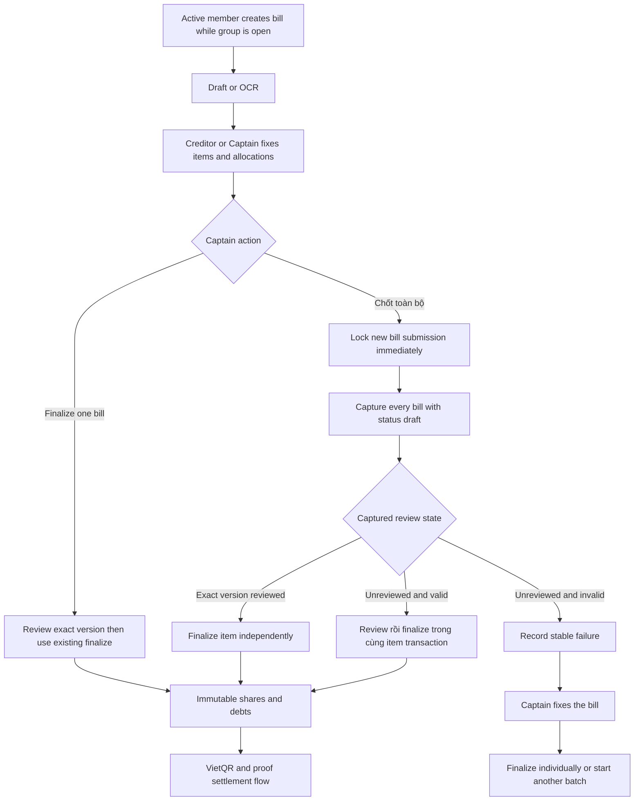

# 0008. Group bill close v1

**Date**: 2026-08-24
**Status**: Proposed
**Target release**: V1

## Summary

V1 lets the Captain stop every member, including the Captain, from creating a new bill in one group. The Captain can also start one bulk finalize operation, which locks new bill submission immediately, captures every draft, then finalizes each valid bill independently. A reviewed bill is still a `draft` whose current version has review fields. A Creditor may review a bill but only the current Captain may finalize it. Existing drafts stay editable, while finalized bills remain immutable under the current bill contract.

Detailed journey from bill intake through debt settlement: [end-to-end-flow.md](end-to-end-flow.md).

## Requirements

**User stories**:

1. As a Captain, I want to stop new bills so that a group expense period can be closed.
2. As a Captain, I want to process every current draft with one finalize action so that I do not open and finalize each valid bill manually.
3. As a member, I want a clear locked state so that I know why I cannot upload or enter another bill.

**Acceptance criteria**:

1. **AC-1**: Only the active Captain can lock new bill submission. Locking is idempotent, records PostgreSQL time and one group activity, and applies to every active member including the Captain. V1 has no unlock action.
2. **AC-2**: When a group is locked, every manual or image based `POST /api/v1/bills` for that `group_id` returns `409 BILL_SUBMISSION_LOCKED`. No bill, OCR job, or create activity is committed. Any attempt scoped image uploaded before the winning lock enters the existing durable cleanup flow. Bill list, detail, settlement, and group reads continue to work.
3. **AC-3**: Locking prevents only new bill creation. A Creditor may continue editing, applying OCR, retrying OCR, reviewing, or deleting their draft when the existing contract allows it. The current Captain may perform the allowed draft actions and is the only role that may individually finalize a bill. Creditor ownership alone never grants finalize permission.
4. **AC-4**: Only the active Captain can start bulk finalize. The start transaction locks the active group, turns on the submission lock before it returns, captures every current bill whose status is `draft`, its version, and whether that version is reviewed, creates one durable batch plus one item per captured bill, writes activities, and enqueues work. The endpoint returns `202` with the batch summary. At most one `queued` or `processing` batch exists per group.
5. **AC-5**: A captured draft whose exact version is already reviewed is finalized through the existing exact version rules. A captured unreviewed draft is validated, reviewed, and finalized for the captured version in the same item transaction. An invalid draft stays unchanged and records a stable failure. Each bill runs independently, so one failure never rolls back another bill that finalized successfully.
6. **AC-6**: The batch result is durable and retry safe. A caller can read summary counts and cursor paginated item results. Failed bills remain in their existing state, can be fixed while submission is locked, and can be finalized individually or included in a later bulk operation.
7. **AC-7**: Starting the same request again with the same `Idempotency-Key` and canonical request returns the same batch. Reusing the key for another group conflicts. Concurrent lock, bill create, bill edit, individual finalize, bulk finalize, and group archive follow the shared group then bill lock order. The first valid commit wins. If bulk start commits first, group disband returns `409 BULK_FINALIZE_IN_PROGRESS` until the batch completes. If archive commits first, bulk start returns the existing not found response.
8. **AC-8**: A bill in `finalized` or `voided` is not captured as new work. Every mutation that would change a finalized bill continues to return `409 BILL_IMMUTABLE`. Correcting a finalized bill still requires the existing Captain void and replacement flow.
9. **AC-9**: Flutter shows the locked state in Group Hub and every create bill entry. The Captain sees `Khóa gửi hóa đơn` and `Chốt toàn bộ`. Bulk finalize has confirmation, progress, success, partial failure, empty, offline, and retry states. A finalized Bill Detail is read only.
10. **AC-10**: Lock and batch APIs require a live session and active group membership. A non Captain caller receives `403 CAPTAIN_REQUIRED` from the new lock and batch actions. The existing individual finalize action returns `403 FORBIDDEN` when the caller is not the current Captain. Archived groups and inactive callers receive the existing not found response. Logs and metrics exclude merchant names, item text, image data, bank data, and idempotency keys.

## Decision

**Chosen option**: Durable asynchronous bulk finalize with a one way V1 submission lock

The group row remains the policy and coordination boundary. Bulk finalize stores a fixed bill and version snapshot, then River processes each captured bill with the existing review and finalize rules. This keeps failures isolated and avoids one long transaction across the group.

**Implementation skills**: `supabase-postgres-best-practices` (`supabase/agent-skills`, `.agents/skills/supabase-postgres-best-practices/`)

## Feature design

### Release boundary

V1 does not require debtor accept or reject. The future consent flow remains in [spec 0007](../0007-debtor-bill-consent/index.md) and must not gate review, individual finalize, or bulk finalize in V1.

The V1 submission lock is one way. It ends only when the group is archived. Reopening bill submission is a later product decision.

### Authorization matrix

| Action | Creditor who is not Captain | Current Captain |
|---|---|---|
| Edit, apply OCR, retry OCR, review, or delete a draft | Allowed for their own bill when the existing bill contract allows it | Allowed when the existing bill contract allows it |
| Finalize one reviewed bill | Not allowed. Returns `403 FORBIDDEN` | Allowed |
| Lock new bill submission | Not allowed | Allowed |
| Start or read a bulk finalize batch | Not allowed | Allowed |

Creditor ownership and Captain governance are separate. If one member is both the Creditor and the current Captain, finalize is allowed because that member holds the Captain role, not because that member owns the bill.

### Data model

| Entity | Required fields | Nullable fields | Relations and constraints |
|---|---|---|---|
| `groups` | Existing fields | `bill_submission_locked_at timestamptz` | Null means open. A nonnull value means no new bill may be created. The value never returns to null in V1. |
| `group_bill_finalize_batches` | `id uuid`, `group_id uuid`, `requested_by_member_id uuid`, `status bulk_finalize_status`, `target_count int`, `finalized_count int`, `failed_count int`, `created_at timestamptz`, `updated_at timestamptz` | `started_at timestamptz`, `completed_at timestamptz` | Group scoped foreign keys. Counts are nonnegative and `finalized_count + failed_count <= target_count`. Status is `queued`, `processing`, or `completed`. A partial unique index on `group_id` for `queued` and `processing` enforces one active batch. |
| `group_bill_finalize_items` | `batch_id uuid`, `bill_id uuid`, `bill_version int`, `captured_reviewed boolean`, `status bulk_finalize_item_status`, `created_at timestamptz`, `updated_at timestamptz` | `error_code text`, `processed_at timestamptz` | Primary key `(batch_id, bill_id)` and foreign key from `batch_id` to the batch. `bill_id` is an immutable captured identifier without a hard foreign key, matching the existing redacted draft delete audit pattern so a failed draft may still be hard deleted. The worker always reads the bill by both captured `bill_id` and the batch group. Item status is `pending`, `finalized`, or `failed`. |

Use existing `idx_bills_group_status` to capture open bills by group and status. Add `(group_id, created_at DESC, id DESC)` for latest batch lookup and `(batch_id, status, bill_id)` for item reads. Every new foreign key column or matching composite prefix has an index.

The batch state matrix is constrained. A `queued` batch has no start or completion time. A `processing` batch has `started_at` and no completion time. A `completed` batch has both times and requires `finalized_count + failed_count = target_count`. A pending item has no error or processed time. A finalized item has a processed time and no error. A failed item has a processed time and one nonempty stable error code.

### State transitions

```text
group bill submission
open -> locked

bulk finalize batch
queued -> processing -> completed

bulk finalize item
pending -> finalized
pending -> failed
```

There is no `locked -> open` transition in V1.

### End to end V1 flow



### Start bulk finalize transaction

1. Reserve or replay the idempotency record before mutation.
2. Lock the active group row.
3. Verify the caller is the active Captain.
4. Set `bill_submission_locked_at = COALESCE(bill_submission_locked_at, now())`.
5. Reject a different request with `409 BULK_FINALIZE_IN_PROGRESS` and the active batch ID when one `queued` or `processing` batch already exists.
6. Select bills with status `draft`, ordered by canonical UUID byte order, and capture their current version plus `reviewed_at IS NOT NULL`.
7. Create one batch and one `pending` item for every captured bill.
8. Write `bill_submission_locked` once when the lock changes, then write `bill_bulk_finalize_started` for the batch.
9. Enqueue one River item job per pending bill in the same transaction. A zero pending batch becomes completed immediately with both terminal times set.
10. Commit and return `202` with the current batch summary.

No receipt storage, OCR provider, notification provider, or other network call runs while the group lock is held.

### Batch item transaction

1. Lock the active group row and batch row. Move a queued batch to processing and set `started_at`, then attempt to lock the bill by captured ID and batch group.
2. Lock the batch item and verify it is still pending.
3. If the bill no longer exists, record stable `BILL_DELETED` without restoring any deleted content.
4. If the current version differs from `bill_version`, record stable `VERSION_CONFLICT`.
5. If the bill is already finalized at the captured version, mark the item finalized without writing duplicate shares, debts, activity, or notifications.
6. If the current draft version is not reviewed, run the current review validation and set its review fields inside this transaction. Then reuse the current finalize authorization, version, reconciliation, allocation, bank, share, debt, activity, notification, and idempotency rules from spec 0003. Any failure rolls back the review change with the rest of that bill transaction.
7. On success, mark the item finalized and increment `finalized_count`.
8. On another stable bill failure, roll back only the finalize work, then record the item failed with a redacted stable code in a separate short transaction.
9. When no pending item remains, mark the batch completed, set the terminal counts and time, append `bill_bulk_finalize_completed`, and notify the current active Captain.

The worker never retries a stable state error. It may retry a transient database or queue failure. The item row prevents duplicate financial writes.

### Bill creation gate

Manual create checks the group policy inside the existing create transaction after locking the active group.

Image create performs a cheap authorized policy read before Cloudinary upload, then rechecks after locking the group in the create transaction. If the group becomes locked between those checks, the request creates no bill and the attempt specific image objects enter the existing durable cleanup flow.

### API surface

| Endpoint | Method | Key inputs | Key outputs | Auth | Key errors |
|---|---|---|---|---|---|
| `/api/v1/groups/{groupId}/bills/lock-submissions` | `POST` | `Idempotency-Key` | lock state and lock time | active Captain | `403 CAPTAIN_REQUIRED`, `404 GROUP_NOT_FOUND`, idempotency conflicts |
| `/api/v1/groups/{groupId}/bills/finalize-all` | `POST` | `Idempotency-Key` | batch ID, status, counts, lock state | active Captain | `403 CAPTAIN_REQUIRED`, `404 GROUP_NOT_FOUND`, `409 BULK_FINALIZE_IN_PROGRESS`, idempotency conflicts |
| `/api/v1/groups/{groupId}/bill-finalize-batches/{batchId}` | `GET` | batch ID, item cursor, limit | batch summary, item results, next cursor | active Captain | `400 INVALID_CURSOR`, `404 BATCH_NOT_FOUND` |
| `/api/v1/groups/{groupId}` | `GET` | existing input | existing group detail plus lock state, with batch navigation only for the active Captain | active member | existing errors |
| `/api/v1/bills` | `POST` | existing manual or multipart input containing `group_id` | existing response when open | active member | existing errors plus `409 BILL_SUBMISSION_LOCKED` |
| `/api/v1/groups/{groupId}` | `DELETE` | existing input | existing archive response | active Captain | existing errors plus `409 BULK_FINALIZE_IN_PROGRESS` while a batch is active |

The lock endpoint returns `200` for a new lock and for an authorized replay of an already locked group. Bulk start returns `202`, including a batch with zero target bills. `BULK_FINALIZE_IN_PROGRESS` includes the safe active `batch_id` so the Captain can resume that batch. Batch detail defaults to 20 items and accepts up to 100, ordered by `(created_at, bill_id)`.

### Public response fields

| Object | Fields |
|---|---|
| Group bill policy | `bill_submission_locked`, `bill_submission_locked_at` |
| Captain batch navigation | `active_bill_finalize_batch_id`, `latest_bill_finalize_batch_id`, omitted for an ordinary member |
| Bulk batch summary | `id`, `group_id`, `status`, `target_count`, `finalized_count`, `failed_count`, `created_at`, `started_at`, `completed_at` |
| Bulk item result | `bill_id`, nullable `bill_display_name`, `bill_version`, `captured_reviewed`, `status`, `error_code`, `processed_at` |

### Value sourcing

| Action | Value produced or displayed | Source |
|---|---|---|
| Read group | Lock state | `groups.bill_submission_locked_at IS NOT NULL` and the stored timestamp |
| Read group as Captain | Active and latest batch links | Partial active batch lookup and newest `(created_at, id)` batch for the same group |
| Lock submissions | Actor and time | Authenticated active Captain membership and PostgreSQL `now()` |
| Start bulk | Target bills, versions, and review state | Locked group query over `bills` with status `draft`, using `reviewed_at IS NOT NULL` for the exact current version |
| Start bulk | Batch ID, status, counts, and times | Server generated UUID, captured row count, zero counters, and PostgreSQL transaction time stored on the batch |
| Process draft item | Review result | Existing server review validation over the captured bill and `bill_version` |
| Process item | Final shares and debts | Existing server allocation and finalize rules for the same captured `bill_version` |
| Batch detail | Counts, status, times, versions, and stable outcomes | Stored batch and item rows, with counters reconciled against terminal item rows |
| Batch detail | Optional bill display name | Current bill row joined by captured bill ID and batch group. A missing row returns null instead of retaining deleted bill content |
| Batch completion | Captain notification | Current active Captain membership at completion and the stored terminal counts. The batch retains the original requester as audit actor |
| Flutter create controls | Enabled or disabled | Group detail lock state, never a client only flag |
| Flutter confirmation counts | Estimated reviewed draft, unreviewed draft, and excluded counts | Currently loaded group bill list. The batch summary returned after submit becomes authoritative |
| Flutter progress and item results | Counts, state, bill label, and error copy | Batch detail response, current bill label when present, generic deleted bill label when absent, and a fixed client mapping from stable `error_code` |

### Key invariants

1. A locked group never creates a new bill.
2. Locking is durable and one way in V1.
3. Starting bulk finalize locks submissions even when there are zero target bills or some bill items fail.
4. One batch captures each open bill at most once through the item primary key. A batch item never blocks the existing hard delete of a draft.
5. At most one batch per group is queued or processing.
6. A group with a queued or processing batch cannot be archived.
7. Each item uses a separate transaction and the existing exact version finalize contract.
8. Batch counters equal terminal item rows when status is completed.
9. Finalized and voided bills are never new batch targets.
10. Finalized bill content, assignments, OCR data, shares, and debts stay immutable.
11. Every conflicting mutation acquires the active group lock before any bill lock. Batch items lock bills in canonical UUID order when more than one row is touched.
12. External calls never run while group, bill, or batch rows are locked.

### Activity and notification contract

| Type | Actor | Required metadata |
|---|---|---|
| `bill_submission_locked` | Captain | `group_id`, `locked_at` |
| `bill_bulk_finalize_started` | Captain | `batch_id`, `target_count`, `captured_reviewed_count`, `captured_unreviewed_count` |
| Existing `finalized_bill` | Captain | Existing per bill metadata from spec 0003 |
| `bill_bulk_finalize_completed` | Captain | `batch_id`, `target_count`, `finalized_count`, `failed_count` |

Existing per bill finalize notifications continue to reach share participants. Batch completion creates one in app and push notification for the current active Captain. Payloads contain identifiers, counts, outcome, and deep link only.

### Security model

1. Every endpoint requires the existing bearer token and live session.
2. Group detail exposes lock state to active members.
3. Only the current Captain may finalize one bill. Review by a Creditor does not grant finalize permission.
4. Only the active Captain may lock or start and read a bulk batch. A batch already authorized at start continues if Captain membership changes.
5. Ordinary members cannot infer batch IDs or item failures. Group Detail omits Captain batch navigation fields for them.
6. An archived group returns the existing not found response.
7. Stored item error codes are stable and redacted. They never contain item text, bank fields, signed URLs, or provider output.

### Observability

1. `paysplit_group_bill_submission_locks_total{outcome}` with bounded outcomes `success`, `already_locked`, `forbidden`, and `failed`.
2. `paysplit_group_bill_bulk_batches_total{outcome}` with bounded outcomes `completed`, `partial`, `empty`, and `failed`.
3. `paysplit_group_bill_bulk_items_total{outcome}` with bounded outcomes `finalized`, `version_conflict`, `not_ready`, `bank_required`, `deleted`, and `failed`.
4. `paysplit_group_bill_bulk_duration_seconds{outcome}` measures batch creation to completion.
5. Logs contain group, batch, bill, actor, and stable outcome identifiers only.

### Critical test scenarios

1. Captain locks an open group, then manual and image create by the Captain and another member both return `BILL_SUBMISSION_LOCKED`, verifies **AC-1** and **AC-2**.
2. A draft that existed before the lock can still be edited and reviewed by its Creditor, then finalized by the current Captain, verifies **AC-3**.
3. Bulk start with one reviewed draft, one valid unreviewed draft, and one invalid unreviewed draft locks the group immediately, finalizes the first two, keeps the invalid draft unchanged with a stable failure, and completes with exact counts, verifies **AC-4** through **AC-6**.
4. Retry bulk start with the same key returns the same batch and creates no duplicate item, share, debt, activity, or notification, verifies **AC-7**.
5. Race a new image bill against lock. Either create commits before lock and is captured later, or lock commits first and create cleans its attempt objects, verifies **AC-2** and **AC-7**.
6. Race an edit or individual finalize against a batch item. One exact version transition wins and the other records a stable result, verifies **AC-7**.
7. Race draft delete against a batch item. Delete first produces a redacted `BILL_DELETED` item without blocking hard delete. Worker first finalizes the bill and delete receives `BILL_IMMUTABLE`, verifies **AC-3**, **AC-6**, and **AC-7**.
8. Race group disband against bulk start and the final item. An active batch blocks archive, while an archived group cannot start or continue user access, verifies **AC-7** and **AC-10**.
9. Try to mutate a finalized bill through edit, OCR apply, review, delete, and finalize, and receive `BILL_IMMUTABLE`, verifies **AC-8**.
10. Ordinary member, inactive member, cross group Captain, and archived group calls expose no protected batch data, verifies **AC-10**.
11. Flutter confirms the permanent V1 lock, shows batch progress and per bill failures, disables every new bill entry, and keeps existing draft actions available, verifies **AC-9**.
12. A Creditor reviews the current version of their own draft, then individual finalize returns `403 FORBIDDEN` until the current Captain performs the action. No share or debt is created by the rejected request, verifies **AC-3** and **AC-10**.

## Migration plan

### Strategy

Ship one additive Goose migration. Existing groups receive null `bill_submission_locked_at`, so they remain open. The new enums, batch tables, constraints, and indexes have no historical backfill. Deploy readers that tolerate absent batch data before exposing Captain mutations in Flutter.

### Phases

1. Deploy the database migration, generated sqlc code, group lock read fields, and metrics while the new Captain endpoints remain unreachable from released clients.
2. Deploy backend lock and batch APIs, River workers, OpenAPI, concurrency tests, and cleanup race tests.
3. Release Flutter lock visibility and creation gates first, then enable Captain lock and bulk actions after backend readiness is confirmed.
4. Observe lock errors, active batch age, item failures, queue latency, and count reconciliation before completing rollout.

### Rollback

Disable the Flutter actions and backend route registration first. Let any committed batch finish because its financial writes use the existing finalize contract. The application may stop reading the additive fields while preserving all lock, batch, item, activity, and ledger rows for audit. Do not set a locked group back to open or drop the migration during an operational rollback.

### Risks

1. A partial client rollout can show an enabled create action for a group that the server has locked. The server gate remains authoritative and returns `BILL_SUBMISSION_LOCKED`.
2. A stalled River worker can leave a batch active. Alert on active batch age and repair or retry pending jobs instead of opening a second batch.
3. A database rollout without matching workers can accumulate queued items. Route enablement waits for worker readiness.
4. An accidental V1 lock is permanent. The confirmation copy and Captain authorization are the only V1 prevention controls.

## Build plan

The project uses Tracer Bullet. Each slice crosses PostgreSQL, sqlc, repository, usecase, HTTP, Flutter, tests, OpenAPI, and durable knowledge before the next slice grows the feature.

1. Add the one way group lock column, public group policy fields, Captain lock endpoint, create bill gate, image cleanup race coverage, and the first Flutter locked state, satisfies **AC-1** through **AC-3**, **AC-9**, and **AC-10**.
2. Add batch and item schema, active batch and disband guards, indexes, River job args, bulk start transaction, batch detail API, and a minimal Group Hub confirm and progress path for one draft bill, satisfies **AC-4**, **AC-6**, **AC-7**, and **AC-9**.
3. Compose existing review and finalize rules inside each item transaction, record stable failures, reconcile terminal counts, notify the Captain, and render partial results, satisfies **AC-5** through **AC-7**, **AC-9**, and **AC-10**.
4. Complete Home and Group Hub create gates, read only finalized Bill Detail, empty, offline, retry, concurrency, metrics, redaction, OpenAPI, Flutter code generation, and end to end verification, satisfies **AC-2**, **AC-8** through **AC-10**.

## Consequences

**Positive**:

1. Captain can close intake immediately without archiving the group.
2. One invalid bill does not erase successful finalization of other bills.
3. Bulk work reuses the existing financial transaction and audit trail.

**Negative and tradeoffs**:

1. V1 lock cannot be reversed, so accidental confirmation needs a new product change or group replacement.
2. Bulk finalize is eventually complete, not one immediate response.
3. Failed drafts still need manual correction and another finalize action.
4. Two small audit tables and River work increase schema and operational surface.

**Neutral**:

1. Locking does not freeze existing drafts.
2. Individual review and finalize remain available.
3. V2 consent will later add another gate before a bill becomes ready to finalize.

## Follow up

1. Decide whether V2 may reopen bill submission and what audit or permission rules an unlock needs.
2. Enroll this V1 feature in `docs/scope/scope.md` before implementation.
3. Keep consent spec 0007 and its Flutter companion out of the V1 build and OpenAPI rollout.
4. Capture the installed PostgreSQL conventions in the relevant project context before implementation.

## Rationale

Reasoning and options considered: see [rationale.md](rationale.md).
